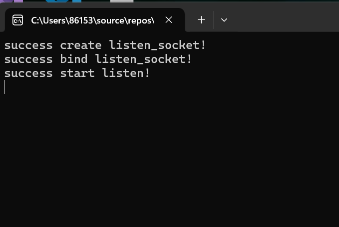
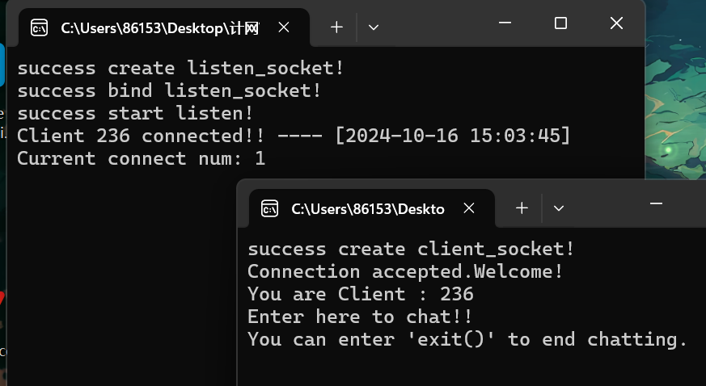
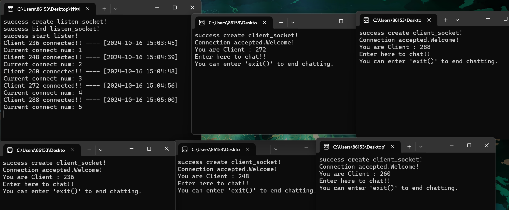
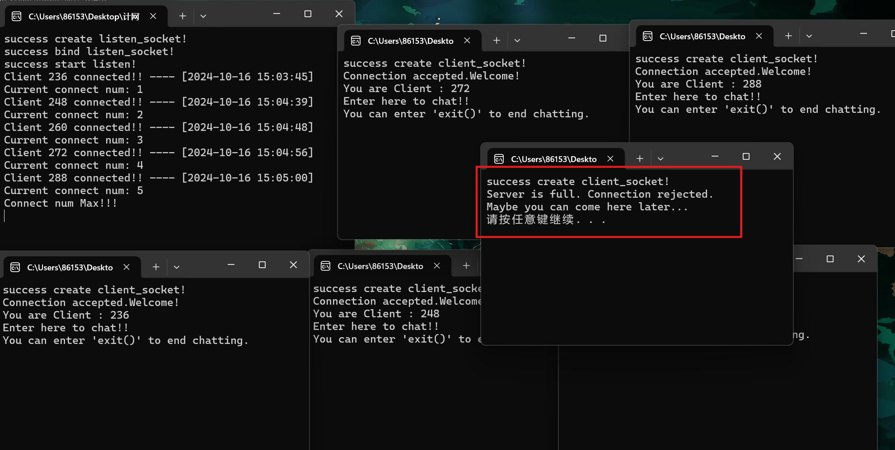
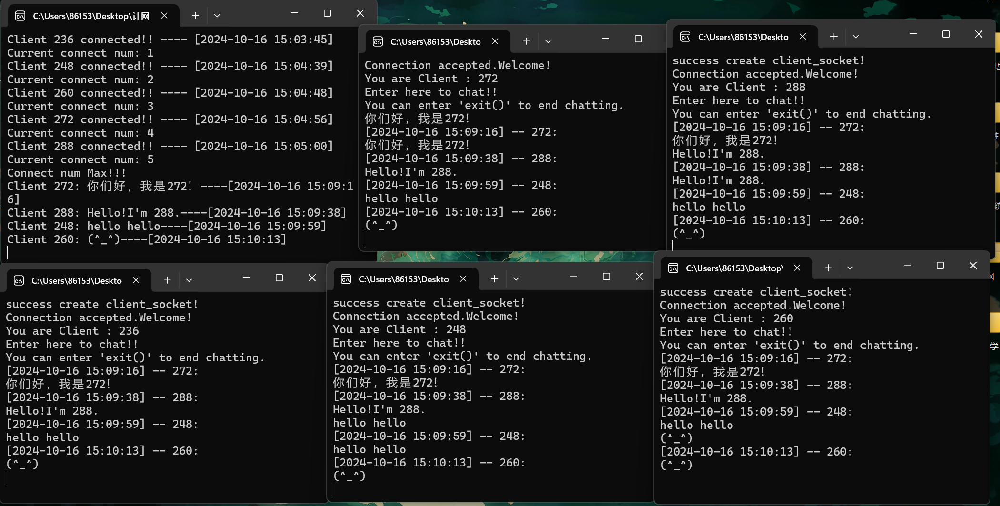
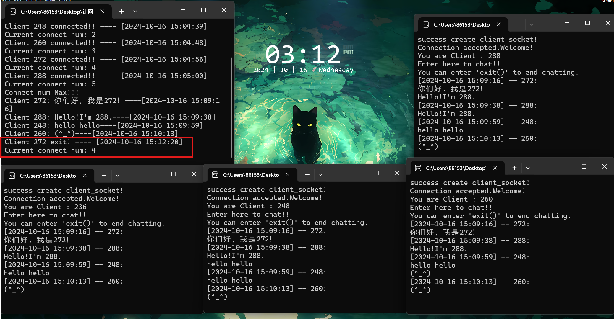
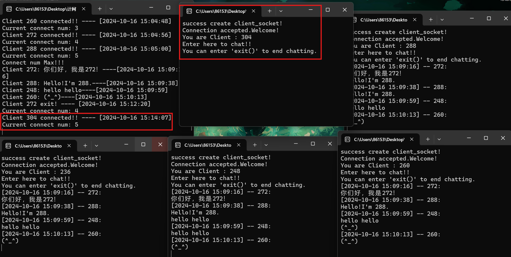
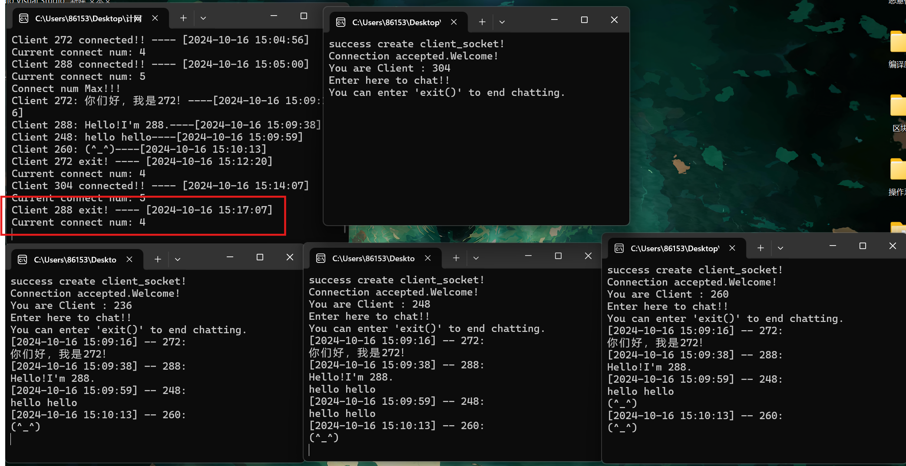
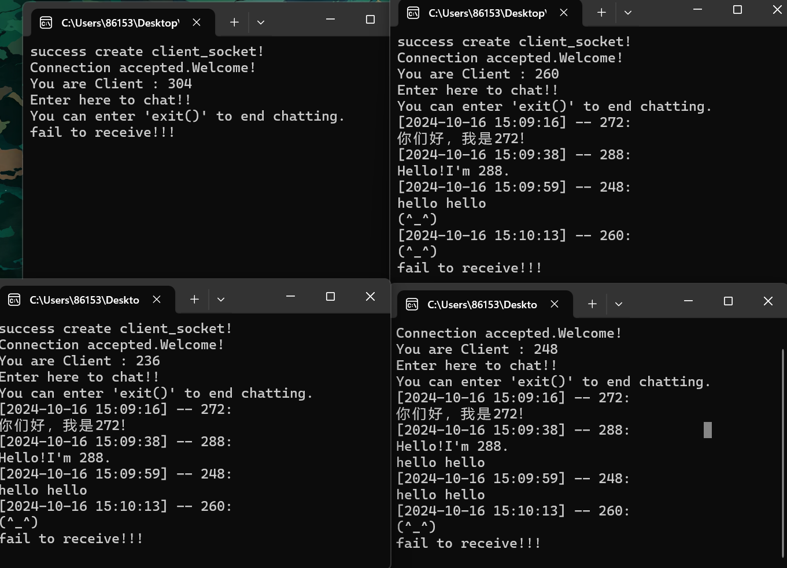

# 计网编程作业1——多人聊天室

## 一、聊天协议介绍

```
SOCKET socket(int af, int type, int protocol);
```

### SOCKET套接字

套接字（Socket）是一种网络编程中的通信端点。

在网络通信中，套接字作为连接两个网络节点的接口，用于发送和接收数据。它是一个包含网络信息（如 IP 地址和端口号）和通信协议的对象，抽象了网络通信的复杂性，通过一个统一的接口，应用程序可以很方便地与网络协议交互。

在创建socket套接字时，需要指定的三个参数为：协议地址族、套接字类型与保护协议。下面对这三个部分进行简介与分析。

### 协议地址族

协议地址族用于标识网络协议中的地址类型，用来支持不同类型的网络通信协议，如 IPv4、IPv6、Unix 套接字等。它定义了在网络通信中如何解释和使用地址信息。

常见的协议地址族包括：**AF_INET**——IPv4 地址族；**AF_INET6**——IPv6 地址族；**AF_UNIX**——用于本地进程间通信的 Unix 套接字，等等。

在本次实验中，我使用了**AF_INET**，即IPv4 地址族。

### 套接字类型

套接字的类型主要决定了网络通信中数据传输的方式以及如何处理连接。

常见的套接字类型包括：**SOCK_STREAM**——流式套接字；**SOCK_DGRAM**——数据报套接字，等等。

在本次实验中，我使用了**SOCK_STREAM**流式套接字。

### 协议

协议（Protocol）是计算机网络中定义通信规则的一组标准，用于确保不同设备之间能够正确地发送和接收数据。它定义了通信中的格式、顺序和处理方法，使不同的计算机、设备和应用能够互操作。

**协议的基本要素**：

1. **语法**：数据格式和信号编码。例如，数据包的格式、头部信息等。
2. **语义**：信息的含义，定义如何解释不同字段和对接收者的响应要求。
3. **时序**：事件的顺序控制和时间同步，确保发送和接收的操作协调一致。

在本次实验中，我将该参数的值置为0，表示根据地址族和套接字类型自动选择合适的协议。结合`AF_INET` 和 `SOCK_STREAM`，协议默认为 `IPPROTO_TCP`，为 TCP 协议。

TCP 是传输层的面向连接的协议，提供可靠的数据传输服务。TCP 能确保数据可靠、有序地传输到目标设备。

## 二、实现流程

### 基本流程

- 根据实验要求，本次实验采用了TCP协议、流式套接字，并采用多线程的方式。
- 分别创建了服务器端server与客户端client。使用时在确保服务器运行的前提下，可以运行多个客户端与服务器连接，加入聊天室，通过服务器进行通信。
- 服务器端与客户端都通过 `send` 和 `recv` 函数来发送与接收数据。除了一些表明当前连接状态的信息通讯外，一个客户端发送给服务器的信息将广播给所有在线的服务端，实现一个聊天室。
- 宏定义服务器端的最大连接数`MaxClient`，缓冲区大小`buf_size`，以及端口号`PORT`为`8080`。
- 当达到最大连接数`MaxClient`时，服务会向新客户端发送一段拒绝信息，客户端接收到该信息后将退出。同样的，接受客户端也会发送接受信息，这样客户端可以知道自己当前的状态并决定下一步操作。

### 服务器端

- 全局中维护一个客户端socket数组`clientSockets`、一个记录客户端是否连接的数组`clientflag`、一个整型当前客户端数量`cur_connect`。

- 设置一个监听socket，用于接收客户端的申请。为该`listen_socket`绑定端口并开启监听属性。

- 用`while(true)`循环等待客户端连接，当接收到时，先用`accept`，为该客户端创建一个`newClientSocket`。接下来判断客户端连接是否已满。

- 如果已满，在服务端打印**“Connect num Max!!!”**，通过`newClientSocket`发送一条拒绝信息，然后关闭`newClientSocket`。

- 如果没满：
  - 先通过数组`clientflag`找到一个没有客户端连接的位置，将`newClientSocket`存入`clientSockets`的对应位置，修改对应标志位与当前连接数，打印**“Current connect num: cur_connect”**。
  
  - 通过数组中的客户端socket发送一条接受信息，记录当前时间并在服务端打印日志信息**“Client xxx connected!! ---- [YYYY-MM-DD HH:MM:SS]”**
  
  - 为当前客户端创建线程，传入客户端下标，用`clientSockets`中的客户端socket进行通信。用`while(true)`循环接收客户信息，接收成功后记录当前时间，在服务端打印**"Client xxx: msg---- [YYYY-MM-DD HH:MM:SS]"**。
  
  - 将时间、客户端编号、消息格式化为广播信息，发送给所有在线的客户端，消息格式为：
  
    > **[YYYY-MM-DD HH:MM:SS] -- xxx:**
    >
    > **msg**
  
  - 如果接收失败，判断错误编号是否为10054。如果是，说明"Connection reset by peer."，对等端重置连接，也就是客户端强制关闭现有连接。那么服务器记录当前时间，打印日志信息**“Client xxx exit! ---- [YYYY-MM-DD HH:MM:SS]”**，然后关闭客户端socket，修改对应标志位与当前连接数，打印**“Current connect num: cur_connect”**。

### 客户端

- 设置一个客户端socket，他的协议要与服务端相同，用于与服务器端发送与接受信息。为其绑定与服务器端相同的端口，并向服务器端发送连接请求。

- 先进行一次`recv`，接受服务器发来的接受或拒绝消息，在客户端打印后，如果接受的是拒绝消息，关闭客户端socket并退出。

- 服务器接受连接后，客户端创建一个接收消息的线程。该线程函数会用`while(true)`循环接收服务器端信息，接收到信息就打印。如果接收失败，大概率是服务器关闭，打印**"fail to receive!!!"**并退出线程。

- 创建线程后，打印一些提示用户输入的信息，接着用`while(true)`循环读取控制台输入并发送给服务器。用户可以在控制台输入要发送的信息，并按下回车键发送。如果输入`exit()`，会结束客户端程序并退出。

- 当用户输入信息按下回车后，客户端比对输入的字符串与`exit()`。

  - 如果相同，`break`退出循环，关闭socket并清除线程，程序结束。

  - 如果不同，向服务器`send`输入的信息，由服务器进行处理和广播。

> 除去上文提及的输出信息，还在程序中输出一些失败信息，如“fail to create client_socket!!”，“fail to connect serve!!”。这些信息一般对应一些错误情况，如服务器未开启，未初始化 Windows 套接字 API 等情况，便于对程序进行Debug。

## 三、代码详解

### 服务端

##### 设置环境变量

```c++
#define _WINSOCK_DEPRECATED_NO_WARNINGS  // 禁止使用旧版本的函数报错
#define _CRT_SECURE_NO_WARNINGS  // 禁止使用不安全的函数报错
# define PORT 8080  // 端口号
# define buf_size 1024  // 缓冲区大小
# define MaxClient 5  // 最大连接数

# include <iostream>
// Socket库
# include <WinSock2.h>
# pragma comment(lib,"ws2_32.lib")

using namespace std;

SOCKET clientSockets[MaxClient];  // 客户端socket数组
bool clientflag[MaxClient];  // 记录客户端状态
int cur_connect = 0;  // 当前客户端数量
```

##### 线程函数

线程函数负责：

1. 初始化缓冲区。
2. 循环接收对应客户端的消息
3. 将其广播到所有在线客户端。
4. 在某个客户端关闭时检测到，关闭该客户端的socket并更新数组状态，更新连接数。

```c++
DWORD WINAPI thread_func(LPVOID lpThreadParameter) {
// 1	
    // 客户端编号
	int client_num = (int)lpThreadParameter;
	// 接受、发送缓冲区
	char rbuffer[buf_size];
	char sbuffer[buf_size];

	// 开始通讯	
	while (true) {
// 2
		// recv()函数接收
		int recvflag = recv(clientSockets[client_num], rbuffer, sizeof(rbuffer), 0);
		if (recvflag > 0) {  // 接收成功
			// 记录当前时间
			SYSTEMTIME st;
			GetLocalTime(&st);
			//  格式化时间字符串
			char timeStr[100];
			sprintf(timeStr, "[%04d-%02d-%02d %02d:%02d:%02d]",
				st.wYear, st.wMonth, st.wDay,
				st.wHour, st.wMinute, st.wSecond);
			// 按格式输出信息
			cout << "Client " << clientSockets[client_num] << ": " << rbuffer << "----" << timeStr << endl;

// 3            
		    // 要将收到的信息广播给所有客户端
			// 格式化发送信息
			sprintf_s(sbuffer, sizeof(sbuffer), "%s -- %d:\n%s", timeStr, clientSockets[client_num], rbuffer);
			// 发送
			for (int i = 0; i < MaxClient; i++) {
				// 如果当前客户端存在
				if(clientflag[i]){
					send(clientSockets[i], sbuffer, sizeof(sbuffer), 0);
				}
			}   	
		}
        
		else {  // 接收失败，通讯结束
// 4            
			// 客户端主动关闭连接
			if (WSAGetLastError() == 10054)
			{
				// 记录当前时间
				SYSTEMTIME st;
				GetLocalTime(&st);
				//  格式化时间字符串
				char timeStr[100];
				sprintf(timeStr, "[%04d-%02d-%02d %02d:%02d:%02d]",
					st.wYear, st.wMonth, st.wDay,
					st.wHour, st.wMinute, st.wSecond);

				cout << "Client " << clientSockets[client_num] << " exit! ---- " << timeStr << endl;
				// 关闭客户端，更新连接情况
				closesocket(clientSockets[client_num]);
				cur_connect--;
				clientflag[client_num] = 0;
				cout << "Current connect num: " << cur_connect << endl;

				return 0;
			}
			else  // 其他错误
			{
				cout << "fail to receive!!" << "errcode: " << GetLastError() << endl;
			    break;
			}
		}
	}
	return 0;
}
```

##### 主函数

主函数负责：

1. 设置初始化 Windows 套接字 API。
2. 设置一个监听socket，用于接收客户端的申请
3. 为该`listen_socket`绑定端口并开启监听属性。
4. 循环，当接收到客户端连接时，判断客户端连接是否已满。
5. 如果没满，为客户端在数组中找到合适的位置，更新连接状态，并向客户端发送接收信息，然后为当前客户端创建线程。
6. 如果已满，向客户端发送一条拒绝信息，然后关闭`newClientSocket`。

```c++
int main() {
// 1
	// 初始化 Windows 套接字 API 
	WSADATA wsaData;
	WSAStartup(MAKEWORD(2, 2), &wsaData);
	
// 2
	// 创建socket套接字，规定协议地址族、套接字类型、协议
	// 监听socket，用于接受客户端申请。IPv4地址族，流式套接字
	SOCKET listen_socket = socket(AF_INET, SOCK_STREAM, 0);
	if (listen_socket == -1) { 
		cout << "fail to create listen_socket!!\n" << "errcode: " << GetLastError() << endl;

		system("pause");
		return -1;
	}
	else { cout << "success create listen_socket!\n"; }

// 3
	// socket绑定端口
	struct sockaddr_in server = { 0 };
	server.sin_family = AF_INET;  // 协议地址族，IPv4
	server.sin_port = htons(PORT);  // 端口号，htons转成大端序
	server.sin_addr.s_addr = htonl(INADDR_ANY);  //htonl转成大端序，INADDR_ANY全零，接受所有
	// bind函数绑定
	int bindflag = bind(listen_socket, (struct sockaddr*)&server, sizeof(server));
	if (bindflag == -1) {
		cout << "fail to bind listen_socket!!\n" << "errcode: " << GetLastError() << endl;

		system("pause");
		return -1;
	}
	else { cout << "success bind listen_socket!\n"; }
	// listen函数开启socket监听属性
	int listen_flag = listen(listen_socket, 10);
	if (listen_flag == -1) {
		cout << "fail to start listen!!\n" << "errcode: " << GetLastError() << endl;

		system("pause");
		return -1;
	}
	else { cout << "success start listen!\n"; }

// 4
	// 等待客户端连接
	while (true) {
		SOCKET newClientSocket = accept(listen_socket, NULL, NULL);  // 接收新的客户端连接

		// 限制连接数
// 5
		if (cur_connect < MaxClient) {  // 没满
			// 为这个客户端设置编号
			int num = 0;
			for (int i = 0; i < MaxClient; i++) {
				if (!clientflag[i]) {
					num = i;
					break;
				}
			}

			// 接受客户端连接
			clientSockets[num] = newClientSocket;
			clientflag[num] = 1;
			cur_connect++;
			// 告诉客户端连接被接受
			const char partMsg[] = "Connection accepted.Welcome!\nYou are Client ";
			char acceptMsg[buf_size];
			sprintf_s(acceptMsg, sizeof(acceptMsg), "%s: %d", partMsg, clientSockets[num]);
			send(clientSockets[num], acceptMsg, sizeof(acceptMsg), 0);

			// 记录当前时间
			SYSTEMTIME st;
			GetLocalTime(&st);
			//  格式化时间字符串
			char timeStr[100];
			sprintf(timeStr, "[%04d-%02d-%02d %02d:%02d:%02d]",
				st.wYear, st.wMonth, st.wDay,
				st.wHour, st.wMinute, st.wSecond);

			// 输出连接信息
			cout << "Client " << clientSockets[num] << " connected!! ---- " << timeStr << endl;
			cout << "Current connect num: " << cur_connect << endl;

			// 进入线程
			HANDLE Thread = CreateThread(NULL, 0, thread_func, (LPVOID)num, 0, NULL);
		    if(Thread == NULL){
				cout << "fail to create thread!!\n";

				system("pause");
				return -1;
			}
			else { CloseHandle(Thread); }
		}
        
// 6
		else { // 已达最大连接	
			cout << "Connect num Max!!!\n";
			const char errMsg[] = "Server is full. Connection rejected.\nMaybe you can come here later...";
			send(newClientSocket, errMsg, sizeof(errMsg), 0);
			// 关闭新连接的客户端socket
			closesocket(newClientSocket);
		}  	
	}

	closesocket(listen_socket);
	WSACleanup();
    return 0;
}
```

### 客户端

##### 设置环境变量

```c++
# define _WINSOCK_DEPRECATED_NO_WARNINGS
# define _CRT_SECURE_NO_WARNINGS
# define PORT 8080  // 端口号
# define buf_size 1024  // 缓冲区大小

# include <iostream>
# include <string>
// Socket库
# include <WinSock2.h>
# pragma comment(lib,"ws2_32.lib")

using namespace std;
```

##### 线程函数

线程函数负责：

1. 循环接收服务器端信息。
2. 接收到信息就打印。
3. 如果接收失败，大概率是服务器关闭，打印**"fail to receive!!!"**并退出线程。

```c++
DWORD WINAPI thread_func(LPVOID lpThreadParameter) {
	SOCKET client_socket = *(SOCKET*)lpThreadParameter;
	free(lpThreadParameter);
// 1
	while (true) {
		char rbuffer[buf_size];
// 2		
		// 接收
		int recvflag = recv(client_socket, rbuffer, sizeof(rbuffer), 0);
		if (recvflag > 0) {  // 接收到信息就打印
			cout << rbuffer << endl;
		}
// 3
		else {
			cout << "fail to receive!!!\n";
			break;
		}
    }
	return 0;
}
```

##### 主函数

主函数负责：

1. 设置客户端socket，他的协议要与服务端相同。

2. 为其绑定与服务器端相同的端口。

3. 向服务器端发送连接请求。

4. 进行一次`recv`，接受服务器发来的接受或拒绝消息，做出判断。

5. 服务器接受连接后，创建一个接收消息的线程。

6. 创建线程后，打印一些提示用户输入的信息。

7. 用`while(true)`循环读取控制台输入，比对输入的字符串与`exit()`。退出程序或将信息发送给服务端。


```c++
int main() {
	// 开启网络权限
	WSADATA wsaData;
	WSAStartup(MAKEWORD(2, 2), &wsaData);
// 1
	// 创建socket套接字,协议要和服务端相同
	SOCKET client_socket = socket(AF_INET, SOCK_STREAM, 0);
	if (client_socket == -1) {
		cout << "fail to create client_socket!!\n" << "errcode: " << GetLastError();
		
		system("pause");
		return -1;
	}
	else { cout << "success create client_socket!\n"; }

// 2
	// IPv4 套接字地址，服务器的
	struct sockaddr_in target = { 0 };
	target.sin_family = AF_INET;
	target.sin_port = htons(PORT);  // 与服务端相同
	target.sin_addr.s_addr = inet_addr("127.0.0.1");  // 本地IP

// 3
    // 连接
	int connectflag = connect(client_socket, (struct sockaddr*)&target, sizeof(target));
	if (connectflag == -1) {
		cout << "fail to connect serve!!\n" << "errcode: " << GetLastError();
		closesocket(client_socket);  // 失败注意要关闭

		system("pause");
		return -1;
	}
    
// 4
	// 先接收一次，看服务器是否发送了拒绝信息
	char rbuffer[buf_size];
	recv(client_socket, rbuffer, sizeof(rbuffer), 0);
	if (strcmp(rbuffer, "Server is full. Connection rejected.\nMaybe you can come here later...") == 0) {  // 接收到拒绝信息
		cout << rbuffer << endl;
		closesocket(client_socket);  // 关闭

		system("pause");
		return -1;
	}
	else {
		cout << rbuffer << endl;
	}


	// 开始通讯
// 5
	// 创建接收消息线程
	SOCKET* sockfd = (SOCKET*)malloc(sizeof(SOCKET));
	*sockfd = client_socket;
	CreateThread(NULL, 0, thread_func, sockfd, 0, NULL);
	
// 6
	// 发送信息
	cout << "Enter here to chat!!\n" << "You can enter 'exit()' to end chatting.\n";
	while (true) {
		// 发送和接受buffer
		char sbuffer[buf_size] = { 0 };
		// cin >> sbuffer;  直接cin只读取得到空格，会把一句英文分多次发送
        cin.getline(sbuffer, sizeof(sbuffer));
        
// 7        
        // 比对输入的字符串与exit()
		if (strcmp(sbuffer, "exit()") == 0) {  // 退出
			break;
		}
		else {  // 发送
			send(client_socket, sbuffer, sizeof(sbuffer), 0);
		}
	}

	// 结束通讯，关闭连接
	closesocket(client_socket);
	WSACleanup();
	return 0;
}
```

## 四、程序演示

打开**serve.exe**，程序输出正常初始化的信息：



打开一个**client.exe**，客户端会接收到正确连接的信息，同时服务端也有日志打印：



再打开四个**client.exe**，都接受到正确连接的信息，并且每个客户端都有不同的编号：



由于服务端的`MaxClient`设为 5，此时应该达到最大连接数，再打开一个客户端，就会收到被拒绝的信息，并且服务端也打印了日志：

关闭这个被拒绝的窗口，我们来测试一下通信，在不同窗口中发送几条信息，可以看到信息被正确广播，服务端也有正确的日志记录：



在272中输入`exit()`，可以看到客户端退出，服务端连接日志更新：



现在再打开一个**client.exe**，正确连接了服务器，说明服务器正确处理了客户退出：



这里直接点**x**关闭客户端程序的终端，服务器也会正确处理退出，但客户端程序是被异常截断的，不建议这种方法。



如果关闭服务器端，所有的客户端都会输出错误信息，但不会结束，因为代码中只是结束了接收消息的线程函数，要输入`exit()`才能退出：



## 五、总结

### 问题

1. **客户端输入一句英文后，无论是服务器端还是别的客户端，收到的信息都是多个独立的单词。**

   这里是因为原本的代码中，读取终端输入直接用的是cin，它每次读到空格就结束了，会开始下一次读取，所以读到的消息是分开的单词。改用了`getline`函数，它会读取用户输入的一整行消息，包括空格，到回车结束，问题解决。

2. **服务器连接满后，打开客户端被拒绝了没错。但关闭一个客户端，服务器已经正确输出了Current connect num减少，打开一个客户端仍旧无法连接，关闭再打开才能正常连接。**

   这是因为在服务器端原本编写的代码逻辑中，一开始没有编写发送拒绝通知的代码部分，后来添加的时候，直接在else分支中进行`accept()`，用于建立一个临时的socket，发送拒绝后就关闭：

   > while(true)
   >
   > ​    if current_num<Maxnum:
   >
   > ​        查找合适位置
   >
   > ​        向数组中放入accept()得到的socket
   >
   > ​        后续
   >
   > ​    else:
   >
   > ​        tempsocket = accept()得到的socket
   >
   > ​        通过tempsocket发送拒绝信息
   >
   > ​        close tempsocket

   这样会导致程序在连接达到最大数后，主函数进入else分支，被`accept()`函数阻塞，察觉不到线程函数对`current_num`的改动。即便有一个用户退出，`current_num`被该用户的线程函数修改，当主函数监听到一个用户申请时，由于它阻塞在else分支中的`accept()`处，一定会拒绝一次，到下一次循环时才会进入正确的if分支。

   修改方法是将`accept()`函数放在ifelse之外，这样会阻塞在分支外部，在接收到时才做判断。

   > while(true)
   >
   > ​    newsocket = accept()得到的socket
   >
   > ​    if current_num<Maxnum:
   >
   > ​        查找合适位置
   >
   > ​        向数组中放入newsocket 
   >
   > ​        后续
   >
   > ​    else:
   >
   > ​        通过newsocket 发送拒绝信息
   >
   > ​        close newsocket 

### 心得体会

在此次实验中，我学习了套接字编程的基本原理，实现了一个多用户聊天室，对协议的设计、线程管理等方面有了更深的理解。虽然过程中遇到了不少挑战，例如处理多线程同步和中英文字符编码问题，但通过不断地调试和查阅资料，我逐步解决了这些困难，增强了自己的编程调试能力。同时，此次实验也让我认识到良好的协议设计和代码规范对于程序的稳定性和可维护性的重要性，这些收获将为我今后的学习打下坚实的基础。