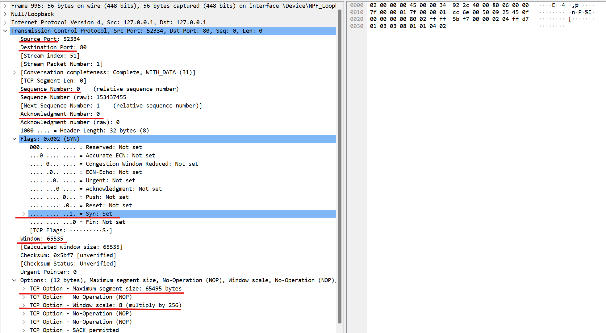

# 计网实验二——配置Web服务器，分析HTTP交互过程

## 一、Web服务器配置

本次实验中使用 phpstudy 中打包好的 Apache2.4.39 提供网页服务。

- 将编写好的main.html与相关图像音频文件打包放在WWW文件夹下。


- 在phpstudy中打开Apache服务，即可在浏览器中访问我们编写的html。


- phpstudy中已经建立了一个默认的localhost站点，使用http协议，绑定端口为80，在后续实验中我们会用到这些信息。


- 按照路径访问页面即可。


页面源码附上：

```html
<!DOCTYPE html>
<html lang="zh-CN">
<head>
    <meta charset="UTF-8">
    <title>个人主页</title>
</head>
<body>
    <h1>个人主页</h1>
    <p>专业：信息安全</p>
    <p>学号：2211532</p>
    <p>姓名：石家伊</p>

    <h2>我的LOGO</h2>
    
    
    <h2>介绍音频</h2>
    <p>以下是我的自我介绍音频：</p>
    <audio controls>
        <source src="intro.mp3" type="audio/mpeg">
        您的浏览器不支持音频播放。
    </audio>
</body>
</html>
```

## 二、交互过程分析

- 开启服务后，我们就打开Wireshark准备捕获。
- 选择`Adapter for loopback traffic capture`接口，并按所用端口设置过滤器`(tcp.srcport == 80 or tcp.dstport == 80)`，筛选源端口或目标端口为80的数据包。
- 用浏览器访问http://localhost/ComNet2/main.html，即可看到Wireshark的抓包信息。


- 下面对整个交互过程进行分析。

### 建立连接

TCP通过三次握手与服务器建立连接。

.png)

在WireShark捕获到的数据中可以看到这三次握手：


#### 第一次握手

客户端向服务器发送了一个**SYN**请求，即客户端向服务器请求连接。此时客户端进入**SYN_SENT（同步已发送）**状态。



可以看到报文的信息：

- Source Port 源端口，即客户端的端口：52334
- Destination Port 目标端口，即服务器的端口：80
- Sequence Number 序列号，表示数据流中该数据包的起始位置：初始为0
- Acknowledge Number 确认号，标识了已经成功接收到的数据字节：初始为0
- Flags 标志位：SYN标识，用于建立连接的初始握手，请求建立连接
- Window 窗口大小，当前接收方（客户端）可以接受的数据量：65535
- Maximum segment size 最大报文段大小，表示单个 TCP 报文段中可以传输的最大数据量（不包含TCP头和Option）：65495
- Window scale  窗口缩放，声明了一个shift count，作为2的指数，再乘以TCP定义的接收窗口，得到实际的TCP窗口大小：8

#### 第二次握手

服务器收到请求后，向客户端发送了一个**ACK+SYN**的回应，表明服务器收到了客户端的请求，并且同意了客户端的请求建立连接，之后进入**SYN_RCVD（同步已接收）**状态。


报文信息中，可以看到：

- 源端口与目标端口号更换。
- Seq序列号仍为0，因为服务器现在还没有发送数据。
- Ack接收号变为1，因为接收到了客户端发来的SYN标志位。
- 发送的Flags为ACK与SYN，ACK用于确认数据的传输，接收方发送一个带有ACK标记的报文段回复发送方，确认已经收到了数据。

#### 第三次握手

最后一次握手，客户端收到服务器端确认后，检查 ack 是否为 x+1，即ACK 是否为 1。如果正确则客户端回应服务器一个**ACK**报文，告诉服务器我收到了你的确认，同时进入E**STABLISHED状态**。


- 源端口与目的端口分别为客户端与服务器端口号。
- Seq变为1，当前已经发送过一次数据（第一次握手）。
- Ack为1，当前接收到了服务器端发来的一字节数据。
- Flags发送的标志位为ACK。

至此，三次握手完毕，客户端与服务器的连接正确建立。

### 数据传输

建立连接后，就开始了数据传输的过程。

浏览器会给对应的服务器发送一个 HTTP 请求，对应的服务器收到这个请求之后，经过计算处理，就会返回一个 HTTP 响应。在HTTP协议中，客户端与服务器之间是一发一收、一问一答的。

在捕获的包中可以看到，一共发生了四次HTTP请求与响应。


根据文件的名称，四次分别请求了html文件、网页中的图片文件、音频文件、浏览器图标。

#### 请求报文

HTTP请求报文由请求行、请求头、空行与请求正文四部分组成。


- 请求行：指明客户端想要执行的操作。
  - 格式：`<请求方法> <请求路径url> <HTTP版本>`
- 请求头：包含一些关于请求的元信息，例如请求源、连接类型等，用于描述请求正文。
- 空行：用于分隔请求头和请求正文。空行后紧跟请求正文。
- 请求正文：主要用于向服务器传递数据，通常在 `POST`、`PUT` 等请求方法中使用，而 `GET` 请求一般不包含请求正文。

**以捕获到的第一个请求为例：**


- 请求行：`GET /ComNet2/main.html HTTP/1.1`。请求方法为`GET`，请求资源路径`/ComNet2/main.html`，使用的HTTP协议为`HTTP/1.1`。
- 请求头：包含了多条信息，如Host指定请求的主机名，User-Agent提供给客户端信息等等。
- 空行
- 请求正文：GET方式不包含请求正文，后面两行蓝字为Wireshark 提供的附加信息。

#### 响应报文

HTTP响应报文主要由状态行、响应头、空行与响应描述四部分组成。


- 状态行：表示服务器对请求的处理结果。

  - 格式：`<HTTP版本> <状态码> <状态描述>`

  > 常见的HTTP状态码
  >
  > **1xx（信息性状态码）**：表示请求已被接收，继续处理。
  >
  > **2xx（成功状态码）**：
  >
  > - **200 OK**：请求成功，服务器返回数据。
  > - **204 No Content**：请求成功，但没有内容返回。
  >
  > **3xx（重定向状态码）**：
  >
  > - **301 Moved Permanently**：资源永久重定向到新的 URL。
  > - **302 Found**：资源临时重定向到新的 URL。
  >
  > **4xx（客户端错误）**：
  >
  > - **400 Bad Request**：请求有误，服务器无法处理。
  > - **401 Unauthorized**：需要身份验证。
  > - **403 Forbidden**：请求被禁止。
  > - **404 Not Found**：请求的资源未找到。
  >
  > **5xx（服务器错误）**：
  >
  > - **500 Internal Server Error**：服务器内部错误。
  > - **503 Service Unavailable**：服务器暂时无法处理请求。

- 响应头：包含了关于响应的一些元信息，例如内容类型、服务器信息、缓存控制等。

- 空行：用于分隔响应头和响应正文。空行之后紧跟响应正文。

- 响应正文：服务器发送给客户端的实际内容，例如 HTML 页面、图片数据、JSON 数据等。

  - 响应正文在状态码 `200 OK` 等成功状态下会包含实际数据，而在 `404 Not Found` 等错误状态下通常包含错误信息。

**以捕获到的第一个请求的响应为例：**


- 状态行：`HTTP/1.1 200 OK`。协议版本为HTTP/1.1 ，状态码为200，状态描述为OK。
- 响应头：包含了多条信息，如Date描述服务器响应的日期和时间，Server描述服务器的类型和版本信息等。
- 空行：分隔响应头和响应正文。
- 响应正文：服务器返回的 HTML 文档内容，将显示在浏览器中。可以看到内容就是我们编写的html源码。

在每一次收到HTTP响应后，客户端都会向服务器发送一个**ACK**表示收到。


### 断开连接

数据传输完成后，服务端会进行四次挥手关闭连接。

-1730131640502-5.png)

在WireShark捕获到的数据中可以看到这四次挥手：


#### 第一次挥手

服务器向客户端发送主动关闭报文**FIN+ACK**，表示服务器要关闭连接，不再发送数据。此时服务器进入 **FIN_WAIT_1** 状态。


- 源端口与目的端口分别为服务器80与客户端52334。
- Seq与Ack再经过多次数据传输后都已改变，为134949与2089。
- Flags标志位为FIN与ACK。

#### 第二次挥手

客户端要向服务器确认收到 FIN 包，于是发送 **ACK** 确认包。此时客户端进入 **CLOSE_WAIT** 状态，而服务器在收到ACK后进入 **FIN_WAIT_2** 状态。


- 源端口与目的端口分别为客户端52334与服务器80。是由客户端发给服务器的。
- Seq与Ack，为2089与134950。
- Flags标志位为ACK，表示客户端收到了服务器的主动关闭报文，并回复收到。

#### 第三次挥手

客户端发送 **FIN+ACK** 包，表示它也要关闭连接。此时客户端进入 **LAST_ACK** 状态，等待服务器的最终确认。


- 源端口与目的端口分别为客户端52334与服务器80。是由客户端发给服务器的。
- Seq与Ack，为2089与134950。
- Flags标志位为FIN与ACK，表示客户端也要关闭连接。

#### 第四次挥手

服务器发送 **ACK** 确认包，表示已收到客户端的 FIN 包。此时服务器进入 **TIME_WAIT** 状态。客户端收到ACK报文后，就关闭连接，也处于**CLOSED**状态了。连接完全关闭。


- 源端口与目的端口分别为服务器80与客户端52334。是由服务器发给客户端的。
- Seq与Ack，为134950与2090。
- Flags标志位为ACK，表示服务端收到了客户端的关闭连接请求，并回复确认关闭。

至此，连接断开。访问结束。

## 问题

##### 1、遇到304状态码


因为进行了多次访问而没有清楚浏览器缓存。304状态码的含义是目前请求的信息与之前请求的内容相比没有改动，此时客户端从缓存读取即可，无须由服务器端再发送。

##### 2、找不到`favicon.ico` 文件

> 

刚开始实验时抓到了一个GET失败的结果，上网查询一下是因为浏览器在访问时会默认请求一个网页图标文件，用于显示在标签栏上，但我的项目文件夹以及Apache的根目录中都没有这个图标文件。

于是从网上找了一张Apache的图标图片，用在线工具转为`.ioc`格式，并放在`\Apache2.4.39\htdocs`文件夹下，当项目根目录访问不到这个图标时，默认会去Apache的路径下访问，就可以访问到了。

