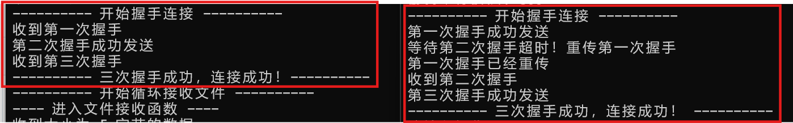
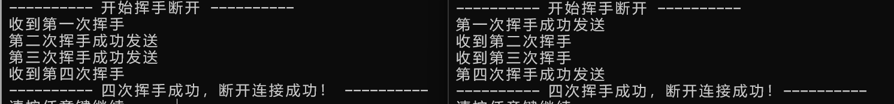
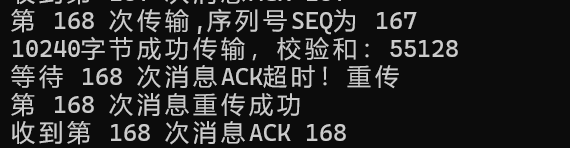
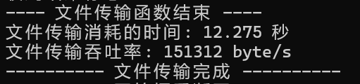
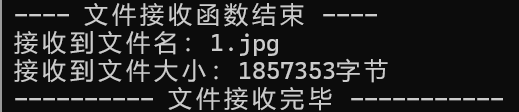

# 计算机网络实验报告 Lab3-1

##### 石家伊 2211532 信息安全

## 一、实验要求

利用数据报套接字在用户空间实现面向连接的可靠数据传输，功能包括：建立连接、差错检测、确认重传等。流量控制采用停等机制，完成给定测试文件的传输。

- 数据报套接字：UDP
- 协议设计：数据包格式，发送端和接收端交互，详细完整
- 建立连接、断开连接：类似TCP的握手、挥手功能
- 差错检验：校验和
- 接收确认、超时重传：rdt2.0、rdt2.1、rdt2.2、rtd3.0等，亦可自行设计协议
- 单向传输：发送端、接收端
- 日志输出：收到/发送数据包的序号、ACK、校验和等，传输时间与吞吐率
- 测试文件：必须使用助教发的测试文件（1.jpg、2.jpg、3.jpg、helloworld.txt）


## 二、协议设计与流程简介

#### Header协议设计

send.exe与receive.exe有一个共同的报头格式，Header大小为64位，其结构如下：

```c++
struct HEADER{
	uint16_t checksum;  // 16位校验和
    uint16_t length;  // 数据长度
	uint8_t seq;  // 序列号
	uint8_t ack;  // 确认序列号
	uint8_t flag;  // 标志位
	uint8_t temp;
};
```


- checksum：16位校验和，用于检测收到的数据包是否出错。
- length：16位消息长度，记录当前数据包携带数据的大小。
- seq：8位序列号，用于数据包排序和丢失恢复。
- ack：8位确认号，由接收端发送，标识下一个期望接收的数据包序列号。
- flag：8位标志位，包含SYN、ACK等控制标志，用于控制连接，如握手与挥手。
- temp：8位空白位，暂时没有实际意义，用于保证header的大小为16的倍数。

flag标志位的规定如下：

```
#define FIN 0x4  // 0100
#define ACK 0x2  // 0010
#define SYN 0x1  // 0001
#define ACK_SYN 0x3  // 0011
#define FIN_ACK 0x6  // 0110
#define ALL_OVER 0x0  // 0000
#define OVER 0xF    // 1111
```

#### 流程简介

##### 三次握手建立连接


- 第一次握手，send端向receive端发送Header，flag = SYN。
- 第二次握手，receive端向send端回复Header，flag = SYN_ACK。
- 第三次握手，send端send端向receive端发送Header，flag = ACK。

##### 四次挥手断开连接


- 第一次挥手，send端向receive端发送Header，flag = FIN_ACK。
- 第二次挥手，receive端向send端回复Header，flag = ACK。
- 第三次挥手，receive端向send端发送Header，flag = FIN_ACK。
- 第四次挥手，send端向receive端发送Header，flag = ACK。

##### 文件传输流程

将一个文件分成“文件名”与“文件内容”分成两次调用函数发送，以下简述一次文件传输的函数流程：

- 根据需要传送文件的大小，计算一共需要发送的次数times。
- 循环times进行传输，每一次传输，计算本次传输的数据大小，除最后一次传输外都是最大大小。
- 设置header信息，将header与需要传输的数据拼接，发送给receive。
- 循环接收receive端的ACK，在每次循环中判断是否超时，超时则重传数据包。
- 最后一次发送结束后，send端会发送一个Header，flag = OVER。
- receive端循环接收数据，每次接收到，判断是否为结束标志OVER，若不是则存储数据，回复相应的ACK。若是，则退出循环，结束接收函数。


## 三、功能实现与代码分析

#### 差错检验

通过计算校验和来实现差错检验。

在发送数据包时，初始化一个header，其中所有位初始都为0，在设置好其它信息后，计算校验和，存入header的checksum位，并发送给接收端。接收端在收到数据包后，会用同样的方法计算header的校验和，若错误则说明收到的数据包存在差错，不进行处理，继续循环接收，而另一端没有收到相应ACK则会超时重传。

checksum的计算代码如下，将header视为一个16位整数数组，循环累加每个16位段，每一次检查是否存在进位溢出，若存在，则将溢出位加到最低位，最后取16位计算结果的补码，存入将要发送的header中。

在接收端收到后，用同样的方法计算校验和，如果数据包没错，求得结果应为0（相当于原始数据加上了checksum中他们的补码，为0）。

```c++
uint16_t checksum(HEADER header) {
	int size = sizeof(header);
	uint16_t* msg = (uint16_t*)&header;  // 将结构体视为 16 位整数数组

	int count = (size + 1) / 2;
	u_short* buf = (u_short*)malloc(size + 1);
	memset(buf, 0, size + 1); // 初始化为0
	memcpy(buf, msg, size);

	uint32_t sum = 0;
	// 循环累加每个 16 位段
	for (int i = 0; i < count; i++) {
		sum += buf[i];
		if (sum & 0xffff0000) {
			sum &= 0xffff;
			sum++;
		}
	}
	return ~(sum & 0xffff);
}
```

#### 三次握手

##### 发送端

- 进入函数，将发送端套接字socket设置为非阻塞状态，便于接收ACK时判断超时重传。

```c++
u_long mode = 1;
ioctlsocket(send_socket, FIONBIO, &mode);
```

- 第一次握手，发送header1，将flag置为SYN并计算校验和，记录第一次握手时间。

```c++
HEADER header1;
char* buf1 = new char[sizeof(header1)];
header1.flag = SYN;  // 设置flag
header1.checksum = 0;
header1.checksum = checksum(header1);  // 计算校验和 
memcpy(buf1, &header1, sizeof(header1));  // 放入缓冲区
int tag = sendto(send_socket, buf1, sizeof(header1), 0, (sockaddr*)&recv_addr, recv_addrlen);
if (tag == -1) {  //验证发送结果
	cout << "第一次握手发送失败！" << endl;
	return false;
}
else {
	cout << "第一次握手成功发送 " << endl;
}
clock_t start = clock();  // 记录第一次握手时间
```

- 循环接收第二次握手，每次循环检查当前时间是否超时，若超时则重新发送header1，更新发送时间，继续循环接收。如果收到，则将收到的数据存入header2，检查flag是否为ACK_SYN且校验和是否正确。正确，则break进行下一步。

```c++
HEADER header2;
char* buf2 = new char[sizeof(header2)];
while (true) {
	int recv_len = recvfrom(send_socket, buf2, sizeof(header2), 0, (sockaddr*)&recv_addr, &recv_addrlen);
	
	// 接收到，检查flag与校验和
	if (recv_len > 0) {
		memcpy(&header2, buf2, sizeof(header2));
		if (header2.flag == ACK_SYN && checksum(header2) == 0) {
			cout << "收到第二次握手" << endl;
			break;
		}
		else {
			cout << "第二次握手数据包出错！" << endl;
		}
	}

	// 每次循环判断是否超时
	if (clock() - start > MAX_TIME) {
		cout << "等待第二次握手超时！重传第一次握手" << endl;
		tag = sendto(send_socket, buf1, sizeof(header1), 0, (sockaddr*)&recv_addr, recv_addrlen);
		if (tag == -1) {  //验证发送结果
			cout << "第一次握手重传失败！" << endl;
			return false;
		}
		else {
			cout << "第一次握手已经重传 " << endl;
		}
		start = clock();  // 更新握手时间
	}
}
```

- 第三次握手，发送header3，将flag置为ACK并计算校验和，发送成功后三次握手结束。

```c++
// 第三次握手，发送ACK
HEADER header3;
char* buf3 = new char[sizeof(header3)];
header3.flag = ACK;  // 设置flag
header3.checksum = 0;
header3.checksum = checksum(header3);  // 计算校验和  
memcpy(buf3, &header3, sizeof(header3));  // 放入缓冲区
tag = sendto(send_socket, buf3, sizeof(header3), 0, (sockaddr*)&recv_addr, recv_addrlen);
if (tag == -1) {  //验证发送结果
	cout << "第三次握手发送失败！" << endl;
	return false;
}
else {
	cout << "第三次握手成功发送" << endl;
}
```

- 将socket恢复为阻塞模式，函数结束，返回true。

```c++
// 恢复阻塞模式
mode = 0;
ioctlsocket(send_socket, FIONBIO, &mode);
// 三次握手结束，成功连接
cout << "---------- 三次握手成功，连接成功！ ----------" << endl;
return true;
```

##### 接收端

- 进入函数后，将发送端套接字socket置为非阻塞状态，便于判断超时重传。

```c++
u_long mode = 1;
ioctlsocket(recv_socket, FIONBIO, &mode);
```

- 循环接收第一次握手，收到后将收到的数据存入header1，检查其flag是否为SYN且校验和是否正确。若正确则break进入下一步，否则不进行回应，等待对方超时重传。

```c++
HEADER header1;
char* buf1 = new char[sizeof(header1)];
while (true) {
	int recvlength = recvfrom(recv_socket, buf1, sizeof(header1), 0, (sockaddr*)&recv_addr, &send_addrlen);

	if (recvlength > 0) {
		memcpy(&header1, buf1, sizeof(header1));
		if (header1.flag == SYN && checksum(header1) == 0) {
			cout << "收到第一次握手" << endl;
			break;
		}
		else {
			cout << "第一次握手错误！" << endl;
		}
	}
}
```

- 第二次握手，发送header2，将flag置为ACK_SYN并计算校验和，记录发送时间。

```c++
HEADER header2;
char* buf2 = new char[sizeof(header2)];
header2.flag = ACK_SYN;  // 设置flag
header2.checksum = 0;
header2.checksum = checksum(header2);  // 计算校验和 
memcpy(buf2, &header2, sizeof(header2));  // 放入缓冲区
int tag = sendto(recv_socket, buf2, sizeof(header2), 0, (sockaddr*)&recv_addr, send_addrlen);
if (tag == -1) {  //验证发送结果
	cout << "第二次握手发送失败！" << endl;
	return false;
}
else {
	cout << "第二次握手成功发送" << endl;
}
clock_t start = clock();  // 记录第二次握手时间
```

- 循环接收第三次握手，每次循环检查当前时间是否超时，若超时则重新发送header2，更新发送时间，继续循环接收。如果收到，则将收到的数据存入header3，检查flag是否为ACK且校验和是否正确。正确，则break。

```c++
HEADER header3;
char* buf3 = new char[sizeof(header3)];
while (true) {
	int recvlength = recvfrom(recv_socket, buf3, sizeof(header3), 0, (sockaddr*)&recv_addr, &send_addrlen);

	// 接收到，检查flag与校验和
	if (recvlength > 0) {
		memcpy(&header3, buf3, sizeof(header3));
		if (header3.flag == ACK && checksum(header3) == 0) {
			cout << "收到第三次握手" << endl;
			break;
		}
		else {
			cout << "第三次握手数据包出错！" << endl;
		}
	}

	// 每次循环判断是否超时
	if (clock() - start > MAX_TIME) {
		cout << "等待第三次握手超时！重传第二次握手" << endl;
		tag = sendto(recv_socket, buf2, sizeof(header2), 0, (sockaddr*)&recv_addr, send_addrlen);
		if (tag == -1) {  //验证发送结果
			cout << "第二次握手重传失败！" << endl;
			return false;
		}
		else {
			cout << "第二次握手已经重传" << endl;
		}
		start = clock();
	}
}
```

- 三次握手结束，将socket恢复为阻塞模式，函数结束，返回true。

```c++
mode = 0;
ioctlsocket(recv_socket, FIONBIO, &mode);
cout << "---------- 三次握手成功，连接成功！----------" << endl;
return true;
```


#### 四次挥手

##### 发送端

- 进入函数，将发送端套接字socket置为非阻塞状态，便于后续判断超时重传。

```c++
u_long mode = 1;
ioctlsocket(send_socket, FIONBIO, &mode);
```

- 第一次挥手，发送header1，将flag置为FIN_ACK并计算校验和，记录发送时间。

```c++
HEADER header1;
char* buf1 = new char[sizeof(header1)];
header1.flag = FIN_ACK;  // 设置flag
header1.checksum = 0;
header1.checksum = checksum(header1);  // 计算校验和 
memcpy(buf1, &header1, sizeof(header1));  // 放入缓冲区
int tag = sendto(send_socket, buf1, sizeof(header1), 0, (sockaddr*)&recv_addr, recv_addrlen);
if (tag == -1) {  //验证发送结果
	cout << "第一次挥手发送失败！" << endl;
	return false;
}
else {
	cout << "第一次挥手成功发送 " << endl;
}
clock_t start = clock();  // 记录第一次挥手时间
```

- 循环接收第二次挥手，每次循环检查当前时间是否超时，若超时则重新发送header1，更新发送时间，继续循环接收。如果收到，则将收到的数据存入header2，检查flag是否为ACK且校验和是否正确。正确，则break。

```c++
HEADER header2;
char* buf2 = new char[sizeof(header2)];
while (true) {
	int recv_lenth = recvfrom(send_socket, buf2, sizeof(header2), 0, (sockaddr*)&recv_addr, &recv_addrlen);
	
	// 接收到，检查flag与校验和
	if (recv_lenth > 0) {
		memcpy(&header2, buf2, sizeof(header2));
		if (header2.flag == ACK && checksum(header2) == 0) {
			cout << "收到第二次挥手" << endl;
			break;
		}
		else {
			cout << "第二次挥手数据包出错！" << endl;
		}
	}

	// 每次循环判断是否超时
	if (clock() - start > MAX_TIME) {
		cout << "等待第二次挥手超时！重传第一次挥手" << endl;
		tag = sendto(send_socket, buf1, sizeof(header1), 0, (sockaddr*)&recv_addr, recv_addrlen);
		if (tag == -1) {  //验证发送结果
			cout << "第一次挥手重传失败！" << endl;
			return false;
		}
		else {
			cout << "第一次挥手已经重传 " << endl;
		}
		start = clock();  // 更新挥手时间
	}
}
```

- 循环接收第二次挥手，这次接收不判断超时，因为receive端在收到第一次挥手后会连续发送第二、三次挥手，第二次成功收到后，只需要连续接收第三次挥手即可。接收到，检查flag是否为FIN_ACK且校验和是否正确。正确，则break。

```c++
HEADER header3;
char* buf3 = new char[sizeof(header3)];
start = clock();  // 更新挥手时间
while (true) {
	int recvlength = recvfrom(send_socket, buf3, sizeof(header3), 0, (sockaddr*)&recv_addr, &recv_addrlen);

	// 接收到，检查flag与校验和
	if (recvlength > 0) {
		memcpy(&header3, buf3, sizeof(header3));
		if (header3.flag == FIN_ACK && checksum(header3) == 0) {
			cout << "收到第三次挥手" << endl;
			break;
		}
		else {
			cout << "第三次挥手数据包出错！" << endl;
		}
	}
}
```

- 第四次挥手，发送header4，将flag置为ACK并计算校验和，发送成功后，四次挥手结束。

```c++
HEADER header4;
char* buf4 = new char[sizeof(header4)];
header4.flag = ACK;  // 设置flag
header4.checksum = 0;
header4.checksum = checksum(header4);  // 计算校验和 
memcpy(buf4, &header4, sizeof(header4));  // 放入缓冲区
tag = sendto(send_socket, buf4, sizeof(header4), 0, (sockaddr*)&recv_addr, recv_addrlen);
if (tag == -1) {  //验证发送结果
	cout << "第四次挥手发送失败！" << endl;
	return false;
}
else {
	cout << "第四次挥手成功发送 " << endl;
}
```

- 将socket恢复为阻塞模式，函数结束，返回true。

```c++
mode = 0;
ioctlsocket(send_socket, FIONBIO, &mode);
cout << "---------- 四次挥手成功，断开连接成功！----------" << endl;
return true;
```

##### 接收端

- 进入函数，将发送端套接字socket置为非阻塞状态，便于后续判断超时重传。

```c++
u_long mode = 1;
ioctlsocket(send_socket, FIONBIO, &mode);
```

- 循环接收第一次挥手，收到后将收到的数据存入header1，检查其flag是否为FIN_ACK且校验和是否正确。若正确则break进入下一步，否则不进行回应，等待对方超时重传。

```c++
HEADER header1;
char* buf1 = new char[sizeof(header1)];
while (true) {
	int recvlength = recvfrom(recv_socket, buf1, sizeof(header1), 0, (sockaddr*)&recv_addr, &send_addrlen);

	if (recvlength > 0) {
		memcpy(&header1, buf1, sizeof(header1));
		if (header1.flag == FIN_ACK && checksum(header1) == 0) {
			cout << "收到第一次挥手" << endl;
			break;
		}
		else {
			cout << "第一次挥手错误！" << endl;
		}
	}
}
```

- 第二次挥手，发送header2，将flag置为ACK并计算校验和。这里不记录时间，连续发送二三两次握手。

```c++
HEADER header2;
char* buf2 = new char[sizeof(header2)];
header2.flag = ACK;  // 设置flag
header2.checksum = 0;
header2.checksum = checksum(header2);  // 计算校验和 
memcpy(buf2, &header2, sizeof(header2));  // 放入缓冲区
int tag = sendto(recv_socket, buf2, sizeof(header2), 0, (sockaddr*)&recv_addr, send_addrlen);
if (tag == -1) {  //验证发送结果
	cout << "第二次挥手发送失败！" << endl;
	return false;
}
else {
	cout << "第二次挥手成功发送" << endl;
}
```

- 第三次挥手，发送header3，将flag置为FIN_ACK并计算校验和。记录发送时间。

```c++
HEADER header3;
char* buf3 = new char[sizeof(header3)];
header3.flag = FIN_ACK;  // 设置flag
header3.checksum = 0;
header3.checksum = checksum(header3);  // 计算校验和 
memcpy(buf3, &header3, sizeof(header3));  // 放入缓冲区
tag = sendto(recv_socket, buf3, sizeof(header3), 0, (sockaddr*)&recv_addr, send_addrlen);
if (tag == -1) {  //验证发送结果
	cout << "第三次挥手发送失败！" << endl;
	return false;
}
else {
	cout << "第三次挥手成功发送" << endl;
}
clock_t start = clock();  // 记录第三次挥手时间
```

- 循环接收第四次挥手，每次循环检查当前时间是否超时，若超时则直接结束挥手。因为receive端发送给send端二、三两次挥手不会丢失，所以超时的情况是send端发来的第四次挥手丢失。但此时send端会认为挥手结束，receive端此时的重传无意义，所以直接认为挥手结束。
- 当然，正常接收到第四次挥手，会检查flag是否为ACK以及checksum是否正确，如果正确也会结束四次挥手。

```c++
HEADER header4;
char* buf4 = new char[sizeof(header4)];
while (true) {
	int recvlength = recvfrom(recv_socket, buf4, sizeof(header4), 0, (sockaddr*)&recv_addr, &send_addrlen);

	// 接收到，检查flag与校验和
	if (recvlength > 0) {
		memcpy(&header4, buf4, sizeof(header4));
		if (header4.flag == ACK && checksum(header4) == 0) {
			cout << "收到第四次挥手" << endl;
			break;
		}
		else {
			cout << "第四次挥手数据包出错！" << endl;
		}
	}
	// 每次循环判断是否超时
	if (clock() - start > MAX_TIME) {
		cout << "---------- 等待第四次挥手超时！直接断开！！ ----------" << endl;
		mode = 0;
		ioctlsocket(recv_socket, FIONBIO, &mode);
        return true;
	}
}
```

- 四次挥手结束，恢复socket阻塞模式，函数结束，返回true。

```c++
mode = 0;
ioctlsocket(recv_socket, FIONBIO, &mode);
cout << "---------- 四次挥手成功，断开连接成功！ ----------" << endl;
return true;
```


#### 数据传输

##### 发送端

- 将socket置为非阻塞状态，便于后续判断超时重传。
- 根据文件大小计算总共需要传输的次数，向上取整。并初始化序列号为0。

```c++
int times = msg_len / MAXSIZE + (msg_len % MAXSIZE != 0);  // 需要发送的次数，向上取整
uint8_t seq_now = 0;  // 初始化序列号
cout << "文件大小 " << msg_len << " 字节" << endl;
cout << "需要传输 " << times << " 次" << endl;
```

- 循环times进行传输，每次传输时，根据当前传输次数判断发送的数据大小。除最后一次传输外，要传输的都是最大大小的MAXSIZE，这里规定为10240字节。如果为最后一次传输，则通过减法算得剩余数据大小。

```c++
int len;
if (i == times) {  // 最后一次传输不是MAX_SIZE
	len = msg_len - MAXSIZE * (times - 1);
}
else {
	len = MAXSIZE;
}
```

- 设置header1信息，设置本次传输的数据长度，序列号，计算校验和，将报头放入缓冲区中。
- 设置本次传输的数据信息，从本次需要传输的数据起始位置开始，取出正确的数据长度，放入缓冲区中的header后面，将header与数据拼接起来，发送，并记录时间。

```c++
// 设置header
HEADER header1;
char* buf1 = new char[sizeof(header1) + len];
header1.flag = 0;
header1.length = len;
header1.seq = seq_now;
header1.checksum = 0;
header1.checksum = checksum(header1);
memcpy(buf1, &header1, sizeof(header1));

// 设置信息
char* msg = &message[(i - 1) * MAXSIZE];
memcpy(buf1 + sizeof(header1), msg, len);

// 发送
int tag = sendto(send_socket, buf1, sizeof(header1) + len, 0, (sockaddr*)&recv_addr, recv_addrlen);
if (tag == -1) {  //验证发送结果
	cout << "第 " << i << " 次传输失败！" << endl;
	return false;
}
else {
	cout << len << "字节成功传输，校验和：" << header1.checksum << endl;
}
clock_t start = clock();  // 记录时间
```

- 循环接收ACK信息，每次循环都判断是否超时，如果超时，则重新发送buf1进行重传，更新发送时间。当收到数据包时，将收到的信息放入header2，检查其中的ack是否是当前seq的下一个。
- 如果正确收到ACK，则退出接受循环，更新当前序列号seq_now，并进行下一次发送。

```c++
	HEADER header2;
	char* buf2 = new char[sizeof(header2)];
	while (true) {
		int recvlength = recvfrom(send_socket, buf2, sizeof(header2), 0, (sockaddr*)&recv_addr, &recv_addrlen);
		
		// 接收到，检查ack与校验和
		if (recvlength > 0) {
			memcpy(&header2, buf2, sizeof(header2));
			if (header2.ack == (seq_now + 1) % 255 && checksum(header2) == 0) {
				cout << "收到第 " << i << " 次消息ACK " << static_cast<int>(header2.ack) << endl;
				break;
			}
			else {
				cout << "第 " << i << "次消息ACK出错！" << endl;
			}
		}
		// 判断是否超时
		if (clock() - start > MAX_TIME) {
			cout << "等待 " << i << " 次消息ACK超时！重传" << endl;
			tag = sendto(send_socket, buf1, sizeof(header1) + len, 0, (sockaddr*)&recv_addr, recv_addrlen);
			if (tag == -1) {  //验证发送结果
				cout << "第 " << i << " 次消息重传失败！" << endl;
				return false;
			}
			else {
				cout << "第 " << i << " 次消息重传成功" << endl;
			}
			start = clock();  // 记录时间
		}
	}		
	

	// 更新seq，开始下次发送
	seq_now = (seq_now + 1) % 255;
}
```

- 当发送循环结束后，说明本次文件传输完成，send端会发送一个结束标志，将header3的flag设置为OVER并发送。之后循环接收，这里也具有超时重传的机制。收到信息后检验接收到的ACK包flag是否为OVER，如果正确则说明接收端已知文件传输完成，就可以结束传输函数。

```c++
// 循环传输结束，发送结束标志
HEADER header3;
char* buf3 = new char[sizeof(header3)];
header3.flag = OVER;  // 设置flag
header3.checksum = 0;
header3.checksum = checksum(header3);  // 计算校验和 
memcpy(buf3, &header3, sizeof(header3));  // 放入缓冲区
int tag = sendto(send_socket, buf3, sizeof(header3), 0, (sockaddr*)&recv_addr, recv_addrlen);
if (tag == -1) {  //验证发送结果
	cout << "结束标志发送失败！" << endl;
	return false;
}
else {
	cout << "结束标志发送成功" << endl;
}
clock_t start = clock();  // 记录时间

// 等待结束标志确认
while (true) {
	int recvlength = recvfrom(send_socket, buf3, sizeof(header3), 0, (sockaddr*)&recv_addr, &recv_addrlen);

	// 接收到，检查标志位与校验和
	if (recvlength > 0) {
		memcpy(&header3, buf3, sizeof(header3));
		if (header3.flag == OVER && checksum(header3) == 0) {
			cout << "收到结束标志ACK" << endl;
			break;
		}
		else {
			cout << "结束标志ACK出错！" << endl;
		}
	}

	if (clock() - start > MAX_TIME) {
		cout << "等待结束标志确认超时！重传" << endl;
		tag = sendto(send_socket, buf3, sizeof(header3), 0, (sockaddr*)&recv_addr, recv_addrlen);
		if (tag == -1) {  //验证发送结果
			cout << "结束标志重传失败！" << endl;
			return false;
		}
		else {
			cout << "结束标志重传成功" << endl;
		}
		start = clock();  // 记录时间
	}
}
```

- 恢复socket阻塞模式，文件传输函数结束。

```c++
mode = 0;
ioctlsocket(send_socket, FIONBIO, &mode);
// 文件传输结束
cout << "---- 文件传输函数结束 ----" << endl;
return true;
```

##### 接收端

- 将socket置为非阻塞状态，便于后续判断超时重传。
- 初始化接收序列号ack_now为0，序列号seq_now为0，设置length_now为0用于记录当前收到的数据总长。

```c++
uint8_t ack_now = 0;
uint8_t seq_now = 0;
int length_now = 0;  // 当前收到的数据长度
```

- 循环接收文件信息，当收到信息后，将缓冲区中报头大小的数据存入header1中，检查校验和是否有错，若有错，不进行处理，继续循环接收；否则正确则break，对收到的数据进行处理。

```c++
while (true) {
	int recvlength = recvfrom(recv_socket, buf1, sizeof(header1) + MAXSIZE, 0, (sockaddr*)&recv_addr, &send_addrlen);
	
	// 收到检查校验和
	if (recvlength > 0) {
		memcpy(&header1, buf1, sizeof(header1));
		if (checksum(header1) != 0) {
			cout << "校验和出错！" << endl;
		}
		else {
			break;
		}
	}
}
```

- 判断收到的数据是否为结束标志，也就是header1的flag是否为over。如果是，再break一次，进行结束标志ACK的发送。否则是一个普通的数据包，需要进行存储并发送对应ACK。

```c++
// 判断是否是结束标志
if (header1.flag == OVER) {
	cout << "收到文件传输结束标志" << endl;
	break;
}
```

- 对于普通数据包，先根据标志位length的信息得到本次的数据长度，从缓冲区中header结构体的位置之后取出length长度的数据，存入总数据数组，并更新当前总数据长度。
- 之后要回复相应确认包，将ack标志置为下一个seq，即期望收到的下一个数据包序列号，发送，并更新seq_now。

```c++
// 处理普通数据包
int msg_len = header1.length;
cout << "收到大小为 " << msg_len << " 字节的数据"  << endl;
memcpy(message + length_now, buf1 + sizeof(header1), msg_len);
length_now += msg_len;

// 回复确认包
HEADER header2;
char* buf2 = new char[sizeof(header2)];
header2.flag = 0;
ack_now = (seq_now + 1) % 255;
header2.ack = ack_now;
header2.seq = seq_now;
header2.checksum = 0;
header2.checksum = checksum(header2);
memcpy(buf2, &header2, sizeof(header2));
sendto(recv_socket, buf2, sizeof(header2), 0, (sockaddr*)&recv_addr, send_addrlen);
cout << "成功回复ACK " << static_cast<int>(header2.ack) << endl;
cout << "当前序列号SEQ " << static_cast<int>(header2.seq) << endl;

seq_now = (seq_now + 1) % 255;
```

- 对于结束标志，需要回应特定的ACK，发送的header3中flag位要设置为OVER。发送后本次文件传输结束，退出函数，并返回收到的数据总大小。

```c++
// 循环接收结束，发送数据结束标志
HEADER header3;
char* buf3 = new char[sizeof(header3)];
header3.flag = OVER;
header3.checksum = 0;
header3.checksum = checksum(header3);
memcpy(buf3, &header3, sizeof(header3));
sendto(recv_socket, buf3, sizeof(header3), 0, (sockaddr*)&recv_addr, send_addrlen);
cout << "已发送数据传输结束标志" << endl;

// 恢复阻塞模式
mode = 0;
ioctlsocket(recv_socket, FIONBIO, &mode);
cout << "---- 文件接收函数结束 ----" << endl;
return length_now;
```


#### 主函数

##### 发送端

- 首先设置套接字信息、目标地址，以及其他基本信息。这里给发送端分配了IP为127.0.0.1，端口7777。

```c++
	WSADATA wsadata;
	WSAStartup(MAKEWORD(2, 2), &wsadata);

	struct sockaddr_in recv_addr;
	recv_addr.sin_family = AF_INET;  // IPV4
	recv_addr.sin_port = htons(7777);
	inet_pton(AF_INET, "127.0.0.1", &recv_addr.sin_addr.s_addr);

	SOCKET send = socket(AF_INET, SOCK_DGRAM, 0);

	int len = sizeof(recv_addr);
```

- 接下来调用三次握手函数，建立与接收端的的连接。

```c++
if (Connect(send, recv_addr, len) == false) {
	cout << "连接失败！!" << endl;
	return 0;
}
```

- 读取用户输入的操作码，如果为0，则直接发送两个结束标志，并进行四次挥手断开连接。否则读取文件名，读入文件，进入文件传输。

```c++
bool flag;
cout << "请输入操作码：\n" << "0：退出  " << "1：传输文件" << endl;
cin >> flag;
if (flag == true) {  // 传输文件
	cout << "请输入你要传入的文件名：";
	string filename;
	cin >> filename;
	ifstream fileIN(filename.c_str(), ifstream::binary); // 以二进制方式打开文件
	// 读入文件内容
	char* buf = new char[100000000];
	int i = 0;
	unsigned char temp = fileIN.get();
	while (fileIN)
	{
		buf[i++] = temp;
		temp = fileIN.get();
	}
	fileIN.close();
```

- 调用两次文件传输函数，一次传输文件名，一次传输文件内容，并记录文件传输的开始及结束时间。在文件传输结束后，输出文件传输的耗时，并和文件大小一起计算出吞吐率。

```c++
		// 开始发送
		cout << "---------- 开始传输文件 ----------" << endl;
		clock_t begin = clock(); // 起始时间

		// 发送文件名
		cout << "文件名传输：" << endl;
		Send(send, recv_addr, len, (char*)(filename.c_str()), filename.length());
		// 发送文件内容
		cout << "文件内容传输：" << endl;
		Send(send, recv_addr, len, buf, i);

		clock_t end = clock(); // 结束时间
		// 计算时间差并输出，单位为秒
		double elapsed_time = static_cast<double>(end - begin) / CLOCKS_PER_SEC;
		cout << "文件传输消耗的时间: " << elapsed_time << " 秒" << endl;
		// 计算吞吐率
		double throughput = (i+filename.length()) / elapsed_time; 
		cout << "文件传输吞吐率: " << throughput << " byte/s" << endl;
		cout << "---------- 文件传输完成 ----------" << endl;

```

- 文件传输结束后，调用四次挥手函数，断开与接收端的连接。

```c++
if (DisConnect(send, recv_addr, len) == false) {
	cout << "断开连接失败！!" << endl;
	return 0;
}
```

##### 接收端

- 首先设置套接字信息、绑定接收端地址，以及其他基本信息。这里给接收端分配了IP为127.0.0.1，端口8888。

```c++
WSADATA wsadata;
WSAStartup(MAKEWORD(2, 2), &wsadata);

struct sockaddr_in recv_addr;
recv_addr.sin_family = AF_INET;  // IPV4
recv_addr.sin_port = htons(8888);
inet_pton(AF_INET, "127.0.0.1", &recv_addr.sin_addr.s_addr);

SOCKET recv = socket(AF_INET, SOCK_DGRAM, 0);

if (bind(recv, (struct sockaddr*)&recv_addr, sizeof(recv_addr)) == -1){
	cout << "绑定套接字失败！" << endl;
	return 1;
}

int len = sizeof(recv_addr);
// 三次握手连接
if (Connect(recv, recv_addr, len) == false) {
	cout << "连接失败！！" << endl;
}
```

- 接下来调用三次握手函数，建立与发送端的的连接。

```c++
// 三次握手连接
if (Connect(recv, recv_addr, len) == false) {
	cout << "连接失败！！" << endl;
}
```

- 调用两次文件接收函数，一次接收文件名，一次接收文件内容。如果发送端那边直接退出，接收端会收到两个结束标志，退出文件接收函数。接收结束后，打印收到文件的基本信息，并进行写入保存。

```c++
// 接收数据
cout << "---------- 开始循环接收文件 ----------" << endl;
char* filename = new char[20];
char* filedata = new char[100000000];
int namelen = Recv(recv, recv_addr, len, filename);
int filelen = Recv(recv, recv_addr, len, filedata);

string name(filename, namelen);
cout << "接收到文件名：" << name << endl;
cout << "接收到文件大小：" << filelen << "字节" << endl;
ofstream file_stream(name, ios::binary); // 创建文件流
file_stream.write(filedata, filelen);// 写入文件内容
file_stream.close();
cout << "---------- 文件接收完毕 -----------" << endl;
```

- 文件传输结束后，调用四次挥手函数，断开与发送端的连接。

```c++
// 四次挥手断开连接
if (DisConnect(recv, recv_addr, len) == false) {
	cout << "断开连接失败！！" << endl;
}
```


## 四、实验结果展示

#### router路由器设置


#### 传输结果

在上图的router设置下，四个文件的传输结果如下：

| 文件名         | 文件大小 byte | 耗时 s | 吞吐率 byte/s |
| -------------- | ------------- | ------ | ------------- |
| 1.jpg          | 1857353       | 18.164 | 102255        |
| 2.jpg          | 5898505       | 53.386 | 110488        |
| 3.jpg          | 11968994      | 113.71 | 105259        |
| helloworld.txt | 1655808       | 15.914 | 104048        |

平均吞吐率：105,512.5 byte/s

#### 日志输出

##### 三次握手



##### 四次挥手



##### 丢包后超时重传



##### 输出传输时间与吞吐率



##### 输出接收文件信息

