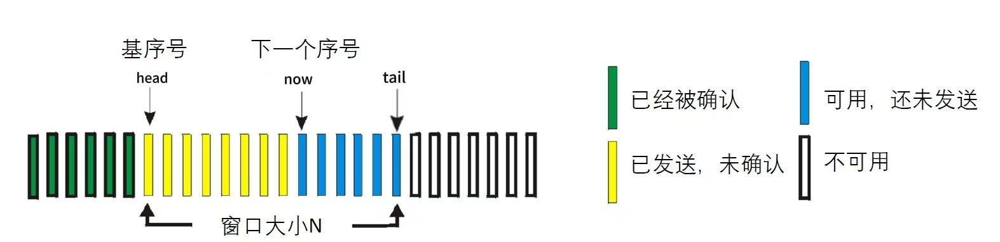

# 计算机网络实验报告 Lab3-2

##### 石家伊 2211532 信息安全

## 一、实验要求

在实验3-1的基础上，将停等机制改成**基于滑动窗口的流量控制机制**，发送窗口和接收窗口采用相同大小，支持**累积确认**，完成给定测试文件的传输。

- 协议设计：数据包格式，发送端和接收端交互，详细完整
- 流水线协议：多个序列号
- 发送缓冲区、接收缓冲区
- 累积确认：Go Back N
- 日志输出：收到/发送数据包的序号、ACK、校验和等，发送端和接收端的窗口大小等情况，传输时间与吞吐率
- 测试文件：必须使用助教发的测试文件（1.jpg、2.jpg、3.jpg、helloworld.txt）


## 二、协议设计

### Header设计

send.exe与receive.exe有一个共同的报头格式，Header大小为64位，其结构如下：

```c++
struct HEADER{
	uint16_t checksum;  // 16位校验和
    uint16_t length;  // 数据长度
	uint8_t seq;  // 序列号
	uint8_t ack;  // 确认序列号
	uint8_t flag;  // 标志位
	uint8_t temp;
};
```


- checksum：16位校验和，用于检测收到的数据包是否出错。
- length：16位消息长度，记录当前数据包携带数据的大小。
- seq：8位序列号，用于数据包排序和丢失恢复。
- ack：8位确认号，由接收端发送，标识下一个期望接收的数据包序列号。
- flag：8位标志位，包含SYN、ACK等控制标志，用于控制连接，如握手与挥手。
- temp：8位空白位，暂时没有实际意义，用于保证header的大小为16的倍数。

flag标志位的规定如下：

```c++
#define FIN 0x4  // 0100
#define ACK 0x2  // 0010
#define SYN 0x1  // 0001
#define ACK_SYN 0x3  // 0011
#define FIN_ACK 0x6  // 0110
#define OVER 0xF    // 1111
```

### 消息传输机制

#### 1、三次握手建立连接


- 第一次握手，send端向receive端发送Header，flag = SYN。
- 第二次握手，receive端向send端回复Header，flag = SYN_ACK。
- 第三次握手，send端send端向receive端发送Header，flag = ACK。

#### 2、四次挥手断开连接


- 第一次挥手，send端向receive端发送Header，flag = FIN_ACK。
- 第二次挥手，receive端向send端回复Header，flag = ACK。
- 第三次挥手，receive端向send端发送Header，flag = FIN_ACK。
- 第四次挥手，send端向receive端发送Header，flag = ACK。

#### 3、差错检测

通过计算校验和来实现差错检验。

在发送数据包时，初始化一个header，其中所有位初始都为0，在设置好其它信息后，计算校验和，存入header的checksum位，并发送给接收端。接收端在收到数据包后，会用同样的方法计算header的校验和，若错误则说明收到的数据包存在差错，不进行处理，继续循环接收，而另一端没有收到相应ACK则会超时重传。

checksum的计算代码如下，将header视为一个16位整数数组，循环累加每个16位段，每一次检查是否存在进位溢出，若存在，则将溢出位加到最低位，最后取16位计算结果的补码，存入将要发送的header中。

在接收端收到后，用同样的方法计算校验和，如果数据包没错，求得结果应为0（相当于原始数据加上了checksum中他们的补码，为0）。

```c++
uint16_t checksum(HEADER header) {
	int size = sizeof(header);
	uint16_t* msg = (uint16_t*)&header;  // 将结构体视为 16 位整数数组

	int count = (size + 1) / 2;
	u_short* buf = (u_short*)malloc(size + 1);
	memset(buf, 0, size + 1); // 初始化为0
	memcpy(buf, msg, size);

	uint32_t sum = 0;
	// 循环累加每个 16 位段
	for (int i = 0; i < count; i++) {
		sum += buf[i];
		if (sum & 0xffff0000) {
			sum &= 0xffff;
			sum++;
		}
	}
	return ~(sum & 0xffff);
}
```

#### 4、滑动窗口和累计确认

在本次实验中，基于GBN流水线协议，使用固定窗口大小，发送端窗口大小 > 1，接收端窗口大小 = 1，实现了流量控制机制。



##### 发送端

- 在进入文件传输后，向上取整计算需要发送的次数times。head为窗口头，初始化为0；tail为窗口尾，根据times与窗口大小的对比，取**窗口大小**或**times**的位置（指向的包并不属于当前窗口）；now为即将发送的下一个包，初始化为0。
- 启动一个接收ACK的线程，该线程负责循环接收receive端发来的ACK，若校验和错误，不会进行任何处理而继续接收；如果正确，查看收到的ACK是否与窗口头head所指向的数据包序列号相同，相同则是重复的ack，忽略并继续接收；如果收到的ACK大于head的序列号，则根据收到的ACK计算窗口向后滑动的步长，向后更改head与tail，实现滑动窗口与累计确认。
- 主线程则负责发送窗口中的数据包，每一次循环判断窗口中（now与tail之间）是否有内容要发送，若有则依次发送now到tail的所有数据包。每次发送数据包结束后，更新最后一次发包的时间，一段时间没有发包，则会进入超时重传，发送当前窗口中的所有数据包。
- 当`head == tail - 1`时，说明窗口已经全部发送并确认，结束接收线程，发送线程发送一个带有OVER结束标志的报头，并等待接收端的OVER回复，收到正确回复，传输函数结束。

##### 接收端

- 接收端循环接收数据包，并记录当前的序列号与ACK，序列号seq_now为当前已经收到的包中最新包的序列号，ack_now为下一个期望收到但还未收到的数据包，回复时会回复ack_now，即下一个期望接收的包序号。
- 当收到一个数据包，接收端检查校验和，并判断是否为结束标志。
- 如果收到一个普通数据包，则检查收到的包header中的seq是否为当前ACK，即本次期望收到的包。如果是，就将包中数据正确存储在缓冲区，并令当前序列号与ACK后移，向发送端回复下一个ACK，表示正确收到了需要的包。否则，接收端不会更改序列号与ACK，直接发送一个重复的ACK，表示需要的包没有收到。
- 如果收到的包为结束标志，要回复发送端一个OVER结束标志，并结束文件接收函数。

#### 5、超时重传

- 如前文所说，发送端每发送一个包，就会更新一下最后发包时间，如果一段时间内没有发包，则说明窗口没有更新，也就说明接收端没有回复正确的ACK，有丢包发生。由于每收到一个正确的ACK窗口都会滑动，此时窗口的第一个包即为未收到正确ACK的包，即之前丢失的包。
- 超时后，将当前的now移动到窗口头head的位置，并继续执行发送线程，下一次循环将会发送循环发送窗口中的所有内容，包括已发送未确认的部分以及未发送的部分。

#### 6、丢包

- 本次实验中我没有使用router，所以在发送端实现了丢包函数。
- 在每一次发送数据包之前，生成一个0-99的随机数，如果这个数小于一个全局指定的LossRate，就continue跳过当前包的发送，这样就实现了以**LossRate%**的概率丢包。


## 三、代码实现

#### 1、主函数main

##### 发送端

- 首先设置套接字信息、目标地址，以及其他基本信息。这里给发送端分配了IP为127.0.0.1，端口8888。

```c++
	WSADATA wsadata;
	WSAStartup(MAKEWORD(2, 2), &wsadata);

	struct sockaddr_in recv_addr;
	recv_addr.sin_family = AF_INET;  // IPV4
	recv_addr.sin_port = htons(SendPort);
	inet_pton(AF_INET, "127.0.0.1", &recv_addr.sin_addr.s_addr);

	SOCKET send = socket(AF_INET, SOCK_DGRAM, 0);

	int len = sizeof(recv_addr);
```

- 接下来调用三次握手函数，建立与接收端的的连接。

```c++
if (Connect(send, recv_addr, len) == false) {
	cout << "连接失败！!" << endl;
	return 0;
}
```

- 读取用户输入的操作码，如果为0，则直接发送两个结束标志，并进行四次挥手断开连接。否则读取文件名，并请用户输入窗口大小，WINDOWS为一个全局变量。读入文件，进入文件传输。

```c++
bool flag;
cout << "请输入操作码：\n" << "0：退出  " << "1：传输文件" << endl;
cin >> flag;
if (flag == true) {  // 传输文件
	cout << "请输入你要传入的文件名：";
	string filename;
	cin >> filename;
    cout << "请输入窗口大小：";
	cin >> WINDOWS;
    
	ifstream fileIN(filename.c_str(), ifstream::binary); // 以二进制方式打开文件
	// 读入文件内容
	char* buf = new char[100000000];
	int i = 0;
	unsigned char temp = fileIN.get();
	while (fileIN)
	{
		buf[i++] = temp;
		temp = fileIN.get();
	}
	fileIN.close();
```

- 调用两次文件传输函数，一次传输文件名，一次传输文件内容，每次传输之前要重新初始化窗口信息，并记录文件传输的开始及结束时间。在文件传输结束后，输出文件传输的耗时，并和文件大小一起计算出吞吐率。

```c++
		// 开始发送
		cout << "---------- 开始传输文件 ----------" << endl;
		clock_t begin = clock(); // 起始时间

		// 发送文件名
		cout << "文件名传输：" << endl;
		head = 0;     // 已发送未确认的头部
		tail = 0;     // 当前窗口尾部
		now = 0;      // 当前发送的序列号
		Send(send, recv_addr, len, (char*)(filename.c_str()), filename.length());
		// 发送文件内容
		cout << "文件内容传输：" << endl;
		head = 0; 
		tail = 0;
		now = 0;  
		Send(send, recv_addr, len, buf, i);

		clock_t end = clock(); // 结束时间
		// 计算时间差并输出，单位为秒
		double elapsed_time = static_cast<double>(end - begin) / CLOCKS_PER_SEC;
		cout << "文件传输消耗的时间: " << elapsed_time << " 秒" << endl;
		// 计算吞吐率
		double throughput = (i+filename.length()) / elapsed_time; 
		cout << "文件传输吞吐率: " << throughput << " byte/s" << endl;
		cout << "---------- 文件传输完成 ----------" << endl;

```

- 文件传输结束后，调用四次挥手函数，断开与接收端的连接。

```c++
if (DisConnect(send, recv_addr, len) == false) {
	cout << "断开连接失败！!" << endl;
	return 0;
}
```

##### 接收端

- 首先设置套接字信息、绑定接收端地址，以及其他基本信息。这里给接收端分配了IP为127.0.0.1，端口8888。

```c++
WSADATA wsadata;
WSAStartup(MAKEWORD(2, 2), &wsadata);

struct sockaddr_in recv_addr;
recv_addr.sin_family = AF_INET;  // IPV4
recv_addr.sin_port = htons(RecvPort);
inet_pton(AF_INET, "127.0.0.1", &recv_addr.sin_addr.s_addr);

SOCKET recv = socket(AF_INET, SOCK_DGRAM, 0);

if (bind(recv, (struct sockaddr*)&recv_addr, sizeof(recv_addr)) == -1){
	cout << "绑定套接字失败！" << endl;
	return 1;
}

int len = sizeof(recv_addr);
// 三次握手连接
if (Connect(recv, recv_addr, len) == false) {
	cout << "连接失败！！" << endl;
}
```

- 接下来调用三次握手函数，建立与发送端的的连接。

```c++
// 三次握手连接
if (Connect(recv, recv_addr, len) == false) {
	cout << "连接失败！！" << endl;
}
```

- 调用两次文件接收函数，一次接收文件名，一次接收文件内容。如果发送端那边直接退出，接收端会收到两个结束标志，退出文件接收函数。接收结束后，打印收到文件的基本信息，并进行写入保存。

```c++
// 接收数据
cout << "---------- 开始循环接收文件 ----------" << endl;
char* filename = new char[20];
char* filedata = new char[100000000];
int namelen = Recv(recv, recv_addr, len, filename);
int filelen = Recv(recv, recv_addr, len, filedata);

string name(filename, namelen);
cout << "接收到文件名：" << name << endl;
cout << "接收到文件大小：" << filelen << "字节" << endl;
ofstream file_stream(name, ios::binary); // 创建文件流
file_stream.write(filedata, filelen);// 写入文件内容
file_stream.close();
cout << "---------- 文件接收完毕 -----------" << endl;
```

- 文件传输结束后，调用四次挥手函数，断开与发送端的连接。

```c++
// 四次挥手断开连接
if (DisConnect(recv, recv_addr, len) == false) {
	cout << "断开连接失败！！" << endl;
}
```


#### 2、三次握手

##### 发送端

- 进入函数，将发送端套接字socket设置为非阻塞状态，便于接收ACK时判断超时重传。

```c++
u_long mode = 1;
ioctlsocket(send_socket, FIONBIO, &mode);
```

- 第一次握手，发送header1，将flag置为SYN并计算校验和，记录第一次握手时间。

```c++
HEADER header1;
char* buf1 = new char[sizeof(header1)];
header1.flag = SYN;  // 设置flag
header1.checksum = 0;
header1.checksum = checksum(header1);  // 计算校验和 
memcpy(buf1, &header1, sizeof(header1));  // 放入缓冲区
int tag = sendto(send_socket, buf1, sizeof(header1), 0, (sockaddr*)&recv_addr, recv_addrlen);
if (tag == -1) {  //验证发送结果
	cout << "第一次握手发送失败！" << endl;
	return false;
}
else {
	cout << "第一次握手成功发送 " << endl;
}
clock_t start = clock();  // 记录第一次握手时间
```

- 循环接收第二次握手，每次循环检查当前时间是否超时，若超时则重新发送header1，更新发送时间，继续循环接收。如果收到，则将收到的数据存入header2，检查flag是否为ACK_SYN且校验和是否正确。正确，则break进行下一步。

```c++
HEADER header2;
char* buf2 = new char[sizeof(header2)];
while (true) {
	int recv_len = recvfrom(send_socket, buf2, sizeof(header2), 0, (sockaddr*)&recv_addr, &recv_addrlen);
	
	// 接收到，检查flag与校验和
	if (recv_len > 0) {
		memcpy(&header2, buf2, sizeof(header2));
		if (header2.flag == ACK_SYN && checksum(header2) == 0) {
			cout << "收到第二次握手" << endl;
			break;
		}
		else {
			cout << "第二次握手数据包出错！" << endl;
		}
	}

	// 每次循环判断是否超时
	if (clock() - start > MAX_TIME) {
		cout << "等待第二次握手超时！重传第一次握手" << endl;
		tag = sendto(send_socket, buf1, sizeof(header1), 0, (sockaddr*)&recv_addr, recv_addrlen);
		if (tag == -1) {  //验证发送结果
			cout << "第一次握手重传失败！" << endl;
			return false;
		}
		else {
			cout << "第一次握手已经重传 " << endl;
		}
		start = clock();  // 更新握手时间
	}
}
```

- 第三次握手，发送header3，将flag置为ACK并计算校验和，发送成功后三次握手结束。

```c++
// 第三次握手，发送ACK
HEADER header3;
char* buf3 = new char[sizeof(header3)];
header3.flag = ACK;  // 设置flag
header3.checksum = 0;
header3.checksum = checksum(header3);  // 计算校验和  
memcpy(buf3, &header3, sizeof(header3));  // 放入缓冲区
tag = sendto(send_socket, buf3, sizeof(header3), 0, (sockaddr*)&recv_addr, recv_addrlen);
if (tag == -1) {  //验证发送结果
	cout << "第三次握手发送失败！" << endl;
	return false;
}
else {
	cout << "第三次握手成功发送" << endl;
}
```

- 将socket恢复为阻塞模式，函数结束，返回true。

```c++
// 恢复阻塞模式
mode = 0;
ioctlsocket(send_socket, FIONBIO, &mode);
// 三次握手结束，成功连接
cout << "---------- 三次握手成功，连接成功！ ----------" << endl;
return true;
```

##### 接收端

- 进入函数后，将发送端套接字socket置为非阻塞状态，便于判断超时重传。

```c++
u_long mode = 1;
ioctlsocket(recv_socket, FIONBIO, &mode);
```

- 循环接收第一次握手，收到后将收到的数据存入header1，检查其flag是否为SYN且校验和是否正确。若正确则break进入下一步，否则不进行回应，等待对方超时重传。

```c++
HEADER header1;
char* buf1 = new char[sizeof(header1)];
while (true) {
	int recvlength = recvfrom(recv_socket, buf1, sizeof(header1), 0, (sockaddr*)&recv_addr, &send_addrlen);

	if (recvlength > 0) {
		memcpy(&header1, buf1, sizeof(header1));
		if (header1.flag == SYN && checksum(header1) == 0) {
			cout << "收到第一次握手" << endl;
			break;
		}
		else {
			cout << "第一次握手错误！" << endl;
		}
	}
}
```

- 第二次握手，发送header2，将flag置为ACK_SYN并计算校验和，记录发送时间。

```c++
HEADER header2;
char* buf2 = new char[sizeof(header2)];
header2.flag = ACK_SYN;  // 设置flag
header2.checksum = 0;
header2.checksum = checksum(header2);  // 计算校验和 
memcpy(buf2, &header2, sizeof(header2));  // 放入缓冲区
int tag = sendto(recv_socket, buf2, sizeof(header2), 0, (sockaddr*)&recv_addr, send_addrlen);
if (tag == -1) {  //验证发送结果
	cout << "第二次握手发送失败！" << endl;
	return false;
}
else {
	cout << "第二次握手成功发送" << endl;
}
clock_t start = clock();  // 记录第二次握手时间
```

- 循环接收第三次握手，每次循环检查当前时间是否超时，若超时则重新发送header2，更新发送时间，继续循环接收。如果收到，则将收到的数据存入header3，检查flag是否为ACK且校验和是否正确。正确，则break。

```c++
HEADER header3;
char* buf3 = new char[sizeof(header3)];
while (true) {
	int recvlength = recvfrom(recv_socket, buf3, sizeof(header3), 0, (sockaddr*)&recv_addr, &send_addrlen);

	// 接收到，检查flag与校验和
	if (recvlength > 0) {
		memcpy(&header3, buf3, sizeof(header3));
		if (header3.flag == ACK && checksum(header3) == 0) {
			cout << "收到第三次握手" << endl;
			break;
		}
		else {
			cout << "第三次握手数据包出错！" << endl;
		}
	}

	// 每次循环判断是否超时
	if (clock() - start > MAX_TIME) {
		cout << "等待第三次握手超时！重传第二次握手" << endl;
		tag = sendto(recv_socket, buf2, sizeof(header2), 0, (sockaddr*)&recv_addr, send_addrlen);
		if (tag == -1) {  //验证发送结果
			cout << "第二次握手重传失败！" << endl;
			return false;
		}
		else {
			cout << "第二次握手已经重传" << endl;
		}
		start = clock();
	}
}
```

- 三次握手结束，将socket恢复为阻塞模式，函数结束，返回true。

```c++
mode = 0;
ioctlsocket(recv_socket, FIONBIO, &mode);
cout << "---------- 三次握手成功，连接成功！----------" << endl;
return true;
```


#### 3、四次挥手

##### 发送端

- 进入函数，将发送端套接字socket置为非阻塞状态，便于后续判断超时重传。

```c++
u_long mode = 1;
ioctlsocket(send_socket, FIONBIO, &mode);
```

- 第一次挥手，发送header1，将flag置为FIN_ACK并计算校验和，记录发送时间。

```c++
HEADER header1;
char* buf1 = new char[sizeof(header1)];
header1.flag = FIN_ACK;  // 设置flag
header1.checksum = 0;
header1.checksum = checksum(header1);  // 计算校验和 
memcpy(buf1, &header1, sizeof(header1));  // 放入缓冲区
int tag = sendto(send_socket, buf1, sizeof(header1), 0, (sockaddr*)&recv_addr, recv_addrlen);
if (tag == -1) {  //验证发送结果
	cout << "第一次挥手发送失败！" << endl;
	return false;
}
else {
	cout << "第一次挥手成功发送 " << endl;
}
clock_t start = clock();  // 记录第一次挥手时间
```

- 循环接收第二次挥手，每次循环检查当前时间是否超时，若超时则重新发送header1，更新发送时间，继续循环接收。如果收到，则将收到的数据存入header2，检查flag是否为ACK且校验和是否正确。正确，则break。

```c++
HEADER header2;
char* buf2 = new char[sizeof(header2)];
while (true) {
	int recv_lenth = recvfrom(send_socket, buf2, sizeof(header2), 0, (sockaddr*)&recv_addr, &recv_addrlen);
	
	// 接收到，检查flag与校验和
	if (recv_lenth > 0) {
		memcpy(&header2, buf2, sizeof(header2));
		if (header2.flag == ACK && checksum(header2) == 0) {
			cout << "收到第二次挥手" << endl;
			break;
		}
		else {
			cout << "第二次挥手数据包出错！" << endl;
		}
	}

	// 每次循环判断是否超时
	if (clock() - start > MAX_TIME) {
		cout << "等待第二次挥手超时！重传第一次挥手" << endl;
		tag = sendto(send_socket, buf1, sizeof(header1), 0, (sockaddr*)&recv_addr, recv_addrlen);
		if (tag == -1) {  //验证发送结果
			cout << "第一次挥手重传失败！" << endl;
			return false;
		}
		else {
			cout << "第一次挥手已经重传 " << endl;
		}
		start = clock();  // 更新挥手时间
	}
}
```

- 循环接收第二次挥手，这次接收不判断超时，因为receive端在收到第一次挥手后会连续发送第二、三次挥手，第二次成功收到后，只需要连续接收第三次挥手即可。接收到，检查flag是否为FIN_ACK且校验和是否正确。正确，则break。

```c++
HEADER header3;
char* buf3 = new char[sizeof(header3)];
start = clock();  // 更新挥手时间
while (true) {
	int recvlength = recvfrom(send_socket, buf3, sizeof(header3), 0, (sockaddr*)&recv_addr, &recv_addrlen);

	// 接收到，检查flag与校验和
	if (recvlength > 0) {
		memcpy(&header3, buf3, sizeof(header3));
		if (header3.flag == FIN_ACK && checksum(header3) == 0) {
			cout << "收到第三次挥手" << endl;
			break;
		}
		else {
			cout << "第三次挥手数据包出错！" << endl;
		}
	}
}
```

- 第四次挥手，发送header4，将flag置为ACK并计算校验和，发送成功后，四次挥手结束。

```c++
HEADER header4;
char* buf4 = new char[sizeof(header4)];
header4.flag = ACK;  // 设置flag
header4.checksum = 0;
header4.checksum = checksum(header4);  // 计算校验和 
memcpy(buf4, &header4, sizeof(header4));  // 放入缓冲区
tag = sendto(send_socket, buf4, sizeof(header4), 0, (sockaddr*)&recv_addr, recv_addrlen);
if (tag == -1) {  //验证发送结果
	cout << "第四次挥手发送失败！" << endl;
	return false;
}
else {
	cout << "第四次挥手成功发送 " << endl;
}
```

- 将socket恢复为阻塞模式，函数结束，返回true。

```c++
mode = 0;
ioctlsocket(send_socket, FIONBIO, &mode);
cout << "---------- 四次挥手成功，断开连接成功！----------" << endl;
return true;
```

##### 接收端

- 进入函数，将发送端套接字socket置为非阻塞状态，便于后续判断超时重传。

```c++
u_long mode = 1;
ioctlsocket(send_socket, FIONBIO, &mode);
```

- 循环接收第一次挥手，收到后将收到的数据存入header1，检查其flag是否为FIN_ACK且校验和是否正确。若正确则break进入下一步，否则不进行回应，等待对方超时重传。

```c++
HEADER header1;
char* buf1 = new char[sizeof(header1)];
while (true) {
	int recvlength = recvfrom(recv_socket, buf1, sizeof(header1), 0, (sockaddr*)&recv_addr, &send_addrlen);

	if (recvlength > 0) {
		memcpy(&header1, buf1, sizeof(header1));
		if (header1.flag == FIN_ACK && checksum(header1) == 0) {
			cout << "收到第一次挥手" << endl;
			break;
		}
		else {
			cout << "第一次挥手错误！" << endl;
		}
	}
}
```

- 第二次挥手，发送header2，将flag置为ACK并计算校验和。这里不记录时间，连续发送二三两次握手。

```c++
HEADER header2;
char* buf2 = new char[sizeof(header2)];
header2.flag = ACK;  // 设置flag
header2.checksum = 0;
header2.checksum = checksum(header2);  // 计算校验和 
memcpy(buf2, &header2, sizeof(header2));  // 放入缓冲区
int tag = sendto(recv_socket, buf2, sizeof(header2), 0, (sockaddr*)&recv_addr, send_addrlen);
if (tag == -1) {  //验证发送结果
	cout << "第二次挥手发送失败！" << endl;
	return false;
}
else {
	cout << "第二次挥手成功发送" << endl;
}
```

- 第三次挥手，发送header3，将flag置为FIN_ACK并计算校验和。记录发送时间。

```c++
HEADER header3;
char* buf3 = new char[sizeof(header3)];
header3.flag = FIN_ACK;  // 设置flag
header3.checksum = 0;
header3.checksum = checksum(header3);  // 计算校验和 
memcpy(buf3, &header3, sizeof(header3));  // 放入缓冲区
tag = sendto(recv_socket, buf3, sizeof(header3), 0, (sockaddr*)&recv_addr, send_addrlen);
if (tag == -1) {  //验证发送结果
	cout << "第三次挥手发送失败！" << endl;
	return false;
}
else {
	cout << "第三次挥手成功发送" << endl;
}
clock_t start = clock();  // 记录第三次挥手时间
```

- 循环接收第四次挥手，每次循环检查当前时间是否超时，若超时则直接结束挥手。因为receive端发送给send端二、三两次挥手不会丢失，所以超时的情况是send端发来的第四次挥手丢失。但此时send端会认为挥手结束，receive端此时的重传无意义，所以直接认为挥手结束。
- 当然，正常接收到第四次挥手，会检查flag是否为ACK以及checksum是否正确，如果正确也会结束四次挥手。

```c++
HEADER header4;
char* buf4 = new char[sizeof(header4)];
while (true) {
	int recvlength = recvfrom(recv_socket, buf4, sizeof(header4), 0, (sockaddr*)&recv_addr, &send_addrlen);

	// 接收到，检查flag与校验和
	if (recvlength > 0) {
		memcpy(&header4, buf4, sizeof(header4));
		if (header4.flag == ACK && checksum(header4) == 0) {
			cout << "收到第四次挥手" << endl;
			break;
		}
		else {
			cout << "第四次挥手数据包出错！" << endl;
		}
	}
	// 每次循环判断是否超时
	if (clock() - start > MAX_TIME) {
		cout << "---------- 等待第四次挥手超时！直接断开！！ ----------" << endl;
		mode = 0;
		ioctlsocket(recv_socket, FIONBIO, &mode);
        return true;
	}
}
```

- 四次挥手结束，恢复socket阻塞模式，函数结束，返回true。

```c++
mode = 0;
ioctlsocket(recv_socket, FIONBIO, &mode);
cout << "---------- 四次挥手成功，断开连接成功！ ----------" << endl;
return true;
```


#### 4、消息传输

##### 发送端

- 程序中声明了几个全局变量。

```c++
const int LossRate = 5;  //丢包率 LossRate/100
int WINDOWS = 1;  // 窗口大小
mutex ack_mutex;  // 用于同步窗口更新的互斥量
int head = 0;     // 窗口头部
int tail = 0;     // 窗口尾部
int now = 0;      // 当前发送到的位置
```

- 进入文件传输函数，根据文件大小与一次传输的最大数据，向上取整求得需要发送的次数。

```c++
cout << "---- 进入文件传输函数 ----" << endl;

int times = msg_len / MAXSIZE + (msg_len % MAXSIZE != 0);  // 需要发送的次数，向上取整

cout << "文件大小 " << msg_len << " 字节" << "需要传输 " << times << " 次" << endl;
```

- 在进入传输函数之前，窗口头head与即将发送的数据包now已经初始化为0，更新tail，如果需要发送的次数times大于窗口大小WINDOWS，则将tail置为WINDOWS，否则置为times。

```c++
tail = (times > WINDOWS) ? WINDOWS : times;  // 尾部
```

- 将socket置为非阻塞状态，便于判断超时重传。

```c++
u_long mode = 1;
ioctlsocket(send_socket, FIONBIO, &mode);
```

- 启动接收ACK的线程ack_thread。这个函数的具体内容在这一部分的后续详细讲解。

```c++
thread ack_thread(ReceiveACK, ref(send_socket), ref(recv_addr), ref(recv_addrlen), ref(head), ref(tail), times);
```

- 在开始发送之前，设置丢包处理的准备工作，初始化一个随机数引擎，用于生成0-99之间的随机数。

```c++
	// 创建一个默认的随机数引擎用于丢包
	std::default_random_engine engine;
	// 初始化随机数引擎，使用当前时间作为种子
	std::seed_seq seed{ static_cast<long unsigned int>(std::time(0)) };
	engine.seed(seed);
	// 0-99之间取随机数
	std::uniform_int_distribution<int> distribution(0, 99);
```

- 开始根据窗口进行while循环，直到head不小于times时，说明窗口头已经移动到结尾，发送结束。

```c++
while (head < times) {
	......  
}
```

- 在每一次循环时，根据now是否小于tail，来判断当前窗口在是否有需要发送的内容（tail指向的位置并不属于当前窗口，它的前一个才是窗口中最后一个包）。如果需要发送，则循环将now到tail的所有包，即窗口中所有未发送的包进行发送。
- 当前需要发送包的seq即为now%256。发送包后，更新最后一次发包时间。
- 在每一次发包前，生成一个随机数，判断它是否小于LossRate，如果小于则输出丢包信息，并continue跳过发送当前数据包，实现了以`LossRate%`的概率随机丢包。

```c++
if (now < tail) {  // 需要进行发送
	// 操作当前窗口，循环发送head到tail的内容
	for (now; now < tail; now++) {
		// 生成随机数，以LossRate的概率丢包
		int randomNumber = distribution(engine);
		if (randomNumber < LossRate) {
			lock_guard<mutex> lock(ack_mutex);
			cout<< "丢包: 当前窗口" << head << " -- " << tail << "  now : " << now << "  seq : " << now % 256 << endl;
			continue;
		}

		// 计算本次传输数据大小
		int len = (now == times - 1) ? (msg_len - MAXSIZE * (times - 1)) : MAXSIZE;

		// 设置header
		HEADER header1;
		char* buf1 = new char[sizeof(header1) + len];
		header1.flag = 0;
		header1.length = len;
		header1.seq = now % 256;
		header1.checksum = 0;
		header1.checksum = checksum(header1);
		memcpy(buf1, &header1, sizeof(header1));

		// 设置信息
		char* msg = &message[now * MAXSIZE];
		memcpy(buf1 + sizeof(header1), msg, len);

		// 发送
		lock_guard<mutex> lock(ack_mutex);
		cout << "[发送] 发送窗口:" << head << " -- " << tail << "  now: " << now << "  seq: " << now % 256 << endl;
		sendto(send_socket, buf1, sizeof(header1) + len, 0, (sockaddr*)&recv_addr, recv_addrlen);
		start = clock();  // 记录数据发送时间
	}	
}
```

- 每一次循环时，还需要判断是否超时，因为每一次发包都会更新最后发包时间，而如果收到正确的ack，接收线程会将窗口右移，使“有包可发”。如果在一段时间内没有发包，则说明接收线程一段内没用收到正确的ACK，没有更新窗口，也就说明丢包了。
- 丢包后，应该发送当前窗口中的所有内容，此时窗口中的第一个包即为之前丢失的包，它未被确认。所以当超时发生，将now移动到head的位置，使得下一次循环会从窗口头开始循环发送窗口内容。

```c++
if (clock() - start > MAX_TIME) {  // 判断超时
	lock_guard<mutex> lock(ack_mutex);
	cout << "等待窗口ACK超时！重传" << endl;
	now = head;
	start = clock();
}
```

- 循环结束后，`head>=times`说明文件内容传输完毕，等待接收线程处理完所有ACK并结束，才会继续执行下面的结束操作。

```c++
cout << "文件内容已全部发送" << endl;

ack_thread.join();  // 等待线程处理完全部ACK
```

- send端会发送一个结束标志，将header3的flag设置为OVER并发送。之后循环接收，这里也具有超时重传的机制。收到信息后检验接收到的ACK包flag是否为OVER，如果正确则说明接收端已知文件传输完成，就可以结束传输函数。

```c++
// 循环传输结束，发送结束标志
HEADER header3;
char* buf3 = new char[sizeof(header3)];
header3.flag = OVER;  // 设置flag
header3.checksum = 0;
header3.checksum = checksum(header3);  // 计算校验和 
memcpy(buf3, &header3, sizeof(header3));  // 放入缓冲区
int tag = sendto(send_socket, buf3, sizeof(header3), 0, (sockaddr*)&recv_addr, recv_addrlen);
if (tag == -1) {  //验证发送结果
	cout << "结束标志发送失败！" << endl;
	return false;
}
else {
	cout << "结束标志发送成功" << endl;
}
clock_t start = clock();  // 记录时间

// 等待结束标志确认
while (true) {
	int recvlength = recvfrom(send_socket, buf3, sizeof(header3), 0, (sockaddr*)&recv_addr, &recv_addrlen);

	// 接收到，检查标志位与校验和
	if (recvlength > 0) {
		memcpy(&header3, buf3, sizeof(header3));
		if (header3.flag == OVER && checksum(header3) == 0) {
			cout << "收到结束标志ACK" << endl;
			break;
		}
		else {
			cout << "结束标志ACK出错！" << endl;
		}
	}

	if (clock() - start > MAX_TIME) {
		cout << "等待结束标志确认超时！重传" << endl;
		tag = sendto(send_socket, buf3, sizeof(header3), 0, (sockaddr*)&recv_addr, recv_addrlen);
		if (tag == -1) {  //验证发送结果
			cout << "结束标志重传失败！" << endl;
			return false;
		}
		else {
			cout << "结束标志重传成功" << endl;
		}
		start = clock();  // 记录时间
	}
}
```

- 恢复socket阻塞模式，文件传输函数结束。

```c++
mode = 0;
ioctlsocket(send_socket, FIONBIO, &mode);
// 文件传输结束
cout << "---- 文件传输函数结束 ----" << endl;
return true;
```

###### 接收ACK线程函数

- 该线程负责接收处理接收端发来的ACK信息。
- 开始根据窗口进行while循环，直到head不小于times时，说明窗口头已经移动到结尾，接收结束。

```c++
while (head < times) {
	......  
}
```

- 每一次循环，调用`recvfrom`函数，如果收到信息，则检查校验和，校验和错误会忽略该信息并继续循环接收。

```c++
if (checksum(header2) != 0) {
	cout << "校验和错误" << endl;
	continue;
}
```

- 校验和正确，则判断当前信息是否为正确的ACK，接收端发来的ACK是下一个期望收到的数据包序列号，所以如果线程收到的ACK等于窗口头head的序列号，则为重复ACK，忽略继续接收。
- 如果是正确的ACK，则根据ack号计算窗口应该移动的步长，将窗口滑动。这里如果tail滑动步长后大于times了，应该停在times的位置，窗口的尾不能大于发送次数。

> 如send端发送了0、1、2三个包，1包丢失。receive端收到0包，回复ACK 1，send端认为0包被确认，将窗口头后移一位，head指向1。
>
> 由于包1丢失，receive端会收到2包，这不是他想要的包，他会回复重复的ACK 1。send端发现收到的ack号与当前窗口头相等，就认为是重复的ACK，不会移动窗口。等待超时重传。

```c++
else {	
	if ((int)header2.ack == (head % 256)) {  // 收到重复ACK，忽略
		continue;
	}
	else {  // 正确ACK，更新窗口 
		lock_guard<mutex> lock(ack_mutex);  // 锁，要更改窗口
		int step = ((int)header2.ack - (head % 256) + 256) % 256;
		
		head += step;
		tail = (tail + step > times) ? times : (tail + step);
		cout << "[接收] 收到正确ack：" << (int)header2.ack << "  窗口更新，右移" << step << "  当前窗口：" << head << " - " << tail << endl;
	}
}
```

##### 接收端

- 将socket置为非阻塞状态，使函数继续执行，来判断超时重传

```c++
u_long mode = 1;
ioctlsocket(recv_socket, FIONBIO, &mode);
```

- 初始化ack_now，表示下一个期望收到的数据包序列号。seq_now表示当前已收到的数据包中最新收到的数据包序列号，它比ack_now少1。

```
uint8_t ack_now = 0;
uint8_t seq_now = 0;
int length_now = 0;  // 当前收到的数据长度
```

- 循环接收数据，当收到数据时，先检查校验和是否正确，如果错误则忽略当前数据包继续接收，如果正确则开始处理数据包。

```c++
while (true) {
	int recvlength = recvfrom(recv_socket, buf1, sizeof(header1) + MAXSIZE, 0, (sockaddr*)&recv_addr, &send_addrlen);

	// 收到检查校验和
	if (recvlength > 0) {
		memcpy(&header1, buf1, sizeof(header1));
		if (checksum(header1) != 0) {
			cout << "校验和出错！" << endl;
		}
		else {
			break;
		}
	}
}
```

- 判断数据包是否为结束标志。如果是结束标志则退出循环接收，进行结束处理。

```c++
if (header1.flag == OVER) {
	cout << "收到文件传输结束标志" << endl;
	break;
}
```

- 如果不是，则处理一个普通数据包。首先判断收到数据包的序列号seq是否等于ack_now，是期望收到的数据包。
- 如果不是，不更新ack_now与seq_now，回复一个重复的ACK信息。

```c++
if (header1.seq != ack_now) {  // 不是期望的数据包，发送重复ACK
		header2.flag = 0;
		header2.ack = ack_now;
		header2.seq = seq_now;
		header2.checksum = checksum(header2);
		memcpy(buf2, &header2, sizeof(header2));
		sendto(recv_socket, buf2, sizeof(header2), 0, (sockaddr*)&recv_addr, send_addrlen);
		cout << "期望收到 " << (int)ack_now << "  本次收到 " << static_cast<int>(header1.seq) << "  发送重复ack "  << (int)header2.ack << endl;
}
```

- 如果是期望的数据包，取出数据并存入缓冲区，更新当前收到的数据大小。根据收到的序列号seq更新ack_now与seq_now，发送对应的ACK，告知发送端正确收到了需要的数据包。

```c++
else {  // 是期望的数据包
	// 取出数据
	int msg_len = header1.length;
	cout << "收到大小为 " << msg_len << " 字节的数据" << endl;
	memcpy(message + length_now, buf1 + sizeof(header1), msg_len);
	length_now += msg_len;

	ack_now = (header1.seq + 1) % 256;
	seq_now = header1.seq;

	// 回复对应ACK
	header2.flag = 0;
	header2.ack = ack_now;
	header2.seq = seq_now;
	header2.checksum = 0;
	header2.checksum = checksum(header2);
	memcpy(buf2, &header2, sizeof(header2));
	sendto(recv_socket, buf2, sizeof(header2), 0, (sockaddr*)&recv_addr, send_addrlen);
	cout << "成功回复ACK " << static_cast<int>(header2.ack) << "  当前序列号SEQ " << static_cast<int>(header2.seq) << endl;
}
```

- 当收到结束标志，说明本次文件传输结束，需要回应特定的ACK，发送的header3中flag位要设置为OVER。发送后本次文件传输结束，退出函数，并返回收到的数据总大小。

```c++
// 循环接收结束，发送数据结束标志
HEADER header3;
char* buf3 = new char[sizeof(header3)];
header3.flag = OVER;
header3.checksum = 0;
header3.checksum = checksum(header3);
memcpy(buf3, &header3, sizeof(header3));
sendto(recv_socket, buf3, sizeof(header3), 0, (sockaddr*)&recv_addr, send_addrlen);
cout << "已发送数据传输结束标志" << endl;

// 恢复阻塞模式
mode = 0;
ioctlsocket(recv_socket, FIONBIO, &mode);
cout << "---- 文件接收函数结束 ----" << endl;
return length_now;
```


## 四、实验结果

### 传输结果

设置LossRate为5，在5%的丢包率下，设置窗口大小为20，四个文件的传输结果如下：

| 文件名         | 文件大小 byte | 耗时 s | 吞吐率 byte/s |
| -------------- | ------------- | ------ | ------------- |
| 1.jpg          | 1857353       | 4.639  | 400379        |
| 2.jpg          | 5898505       | 16.294 | 362005        |
| 3.jpg          | 11968994      | 31.142 | 384336        |
| helloworld.txt | 1655808       | 4.059  | 407938        |

平均吞吐率：338,664.5 byte/s

### 日志输出

#### 三次握手


#### 四次挥手


#### 丢包


#### 超时重传


#### 输出传输时间与吞吐率


#### 输出接收文件信息

