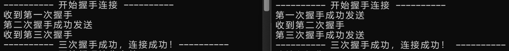
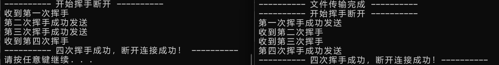
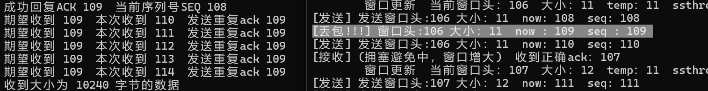
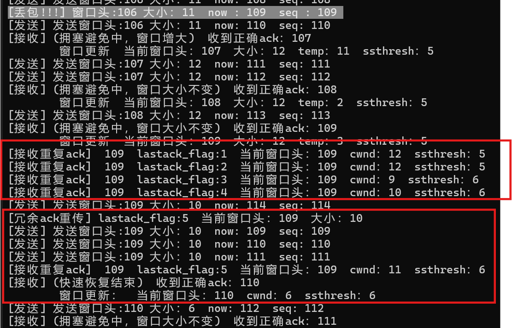
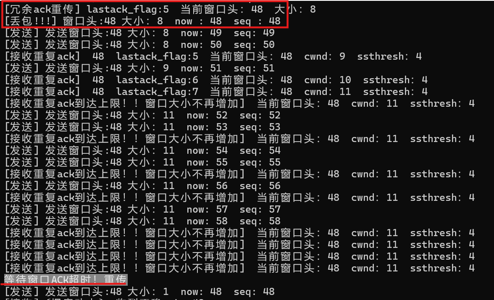
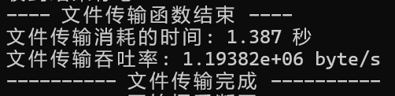
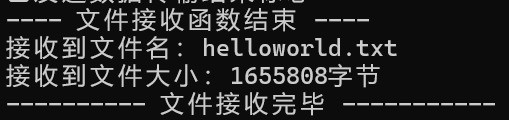

# 计算机网络实验报告 Lab3-3

**石家伊 2211532 信息安全**

## 一、实验要求

在实验3-2的基础上，选择实现一种**拥塞控制**算法，也可以是改进的算法，完成给定测试文件的传输。

- 协议设计：数据包格式，发送端和接收端交互，详细完整
- 发送缓冲区、接收缓冲区
- RENO算法或者自行设计其他拥塞控制算法
- 日志输出：收到/发送数据包的序号、ACK、校验和等，发送端和接收端的窗口大小等情况，传输时间与吞吐率
- 测试文件：必须使用助教发的测试文件（1.jpg、2.jpg、3.jpg、helloworld.txt）


## 二、协议设计

### Header设计

.exe与receive.exe有一个共同的报头格式，Header大小为64位，其结构如下：

```c++
struct HEADER{
	uint16_t checksum;  // 16位校验和
    uint16_t length;  // 数据长度
	uint8_t seq;  // 序列号
	uint8_t ack;  // 确认序列号
	uint8_t flag;  // 标志位
	uint8_t temp;
};
```


- checksum：16位校验和，用于检测收到的数据包是否出错。
- length：16位消息长度，记录当前数据包携带数据的大小。
- seq：8位序列号，用于数据包排序和丢失恢复。
- ack：8位确认号，由接收端发送，标识下一个期望接收的数据包序列号。
- flag：8位标志位，包含SYN、ACK等控制标志，用于控制连接，如握手与挥手。
- temp：8位空白位，暂时没有实际意义，用于保证header的大小为16的倍数。

flag标志位的规定如下：

```c++
#define FIN 0x4  // 0100
#define ACK 0x2  // 0010
#define SYN 0x1  // 0001
#define ACK_SYN 0x3  // 0011
#define FIN_ACK 0x6  // 0110
#define OVER 0xF    // 1111
```

### 消息传输机制

#### 1、三次握手与四次挥手

实现逻辑与前两次相同，简单展示下原理图就不再赘述


#### 2、差错检测

通过计算校验和来实现差错检验。

在发送数据包时，初始化一个header，其中所有位初始都为0，在设置好其它信息后，计算校验和，存入header的checksum位，并发送给接收端。接收端在收到数据包后，会用同样的方法计算header的校验和，若错误则说明收到的数据包存在差错，不进行处理，继续循环接收，而另一端没有收到相应ACK则会超时重传。

checksum的计算代码如下，将header视为一个16位整数数组，循环累加每个16位段，每一次检查是否存在进位溢出，若存在，则将溢出位加到最低位，最后取16位计算结果的补码，存入将要发送的header中。

在接收端收到后，用同样的方法计算校验和，如果数据包没错，求得结果应为0（相当于原始数据加上了checksum中他们的补码，为0）。

```c++
uint16_t checksum(HEADER header) {
	int size = sizeof(header);
	uint16_t* msg = (uint16_t*)&header;  // 将结构体视为 16 位整数数组

	int count = (size + 1) / 2;
	u_short* buf = (u_short*)malloc(size + 1);
	memset(buf, 0, size + 1); // 初始化为0
	memcpy(buf, msg, size);

	uint32_t sum = 0;
	// 循环累加每个 16 位段
	for (int i = 0; i < count; i++) {
		sum += buf[i];
		if (sum & 0xffff0000) {
			sum &= 0xffff;
			sum++;
		}
	}
	return ~(sum & 0xffff);
}
```

#### 3、RENO算法

在本次实验中，基于RENO算法实现了拥塞控制。由于接收端窗口大小为一，所以在重传机制上实现的与RENO略有不同，但大部分的窗口调整等策略是一致的。

##### 发送端

- 在进入文件传输后，向上取整计算需要发送的次数times。head为窗口头，初始化为0；cwnd为窗口大小，初始化为1；ssthresh为慢启动阈值，初始设置为16；last_ack记录目前最后一次收到的ack值，初始化为0；lastack_flag记录上一个ack是否为重复的ack，重复了多少次，初始化为1；

- 启动一个接收ack的线程：该线程负责接收ack并根据情况处理窗口大小。收到ack后，先检验校验和是否正确。如果正确则判断是否收到了正确ack.

  - 收到了正确ack，计算head需要移动的步长step，以支持累计确认

    - 如果上一个收到的ack是重复ack，说明快速回复刚刚结束，将head向后移动，并更新cwnd为ssthresh的大小。
    - 如果此时cwnd<ssthresh，说明处于慢启动阶段，将head向后移动，并将cwnd增加1。
    - 剩下的情况，也就是cwnd>=ssthresh时，说明处于拥塞避免阶段。为收到ack的数量计数，当计数不大于cwnd时，不改变窗口大小，只将head后移；否则还要将窗口大小加一。

    处理结束后，根据当前的ack更新last_ack与lastack_flag的情况，进行下一次接收。

  - 收到重复的ack，先将lastack_flag++

    - 如果lastack_flag<3，还未收到三次重复ack，则输出一下日志但什么也不做。

    - 如果lastack_flag==3，说明收到了三次重复的ack，需要进行重传。先将ssthresh置为当前cwnd/2，再将cwnd置为ssthresh+3，记录需要重传标志位为1。

    - 如果lastack_flag>3，先比较一下快速增长是否达到了上限，如果达到上限就什么都不做，等待超时重传；否则将cwnd++，进行快速恢复。

      > 这里是相较于原本RENO的改动。由于接收端窗口大小为1，丢包的后续的包不会被接收，发送端重传需要发送丢失包以及后续包，如果重传时第一个包丢了，窗口会无限增长下去，需要设置一个上限。

- 主线程负责发送数据包，每次循环按序发送窗口中未发送的内容

  - 在进行循环发送时，判断重传标志位是否为1，如果为1说明收到了三次重复ack，需要进行重传，将即将要发的包now置为head，进行发送。发送时会随机丢包。每次发送结束后会更新计时器。
  - 一段时间没有发包，则会进入超时重传，将now移动到窗口头head，并更新ssthresh为cwnd/2，将cwnd置为1，还需要将lastack_flag置为0，使程序进入慢启动状态，而不是快速重传。

- 当`head >= times`时，说明窗口已经全部发送并确认，结束接收线程，发送线程发送一个带有OVER结束标志的报头，并等待接收端的OVER回复，收到正确回复，传输函数结束。

##### 接收端

- 接收端循环接收数据包，并记录当前的序列号与ACK，序列号seq_now为当前已经收到的包中最新包的序列号，ack_now为下一个期望收到但还未收到的数据包，回复时会回复ack_now，即下一个期望接收的包序号。
- 当收到一个数据包，接收端检查校验和，并判断是否为结束标志。
- 如果收到一个普通数据包，则检查收到的包header中的seq是否为当前ACK，即本次期望收到的包。如果是，就将包中数据正确存储在缓冲区，并令当前序列号与ACK后移，向发送端回复下一个ACK，表示正确收到了需要的包。否则，接收端不会更改序列号与ACK，直接发送一个重复的ACK，表示需要的包没有收到。
- 如果收到的包为结束标志，要回复发送端一个OVER结束标志，并结束文件接收函数。

#### 4、丢包

- 本次实验中我没有使用router，所以在发送端实现了丢包函数。
- 在每一次发送数据包之前，生成一个0-99的随机数，如果这个数小于一个全局指定的LossRate，就continue跳过当前包的发送，这样就实现了以**LossRate%**的概率丢包。


## 三、代码实现

#### 1、主函数main

##### 发送端

- 首先设置套接字信息、目标地址，以及其他基本信息。这里给发送端分配了IP为127.0.0.1，端口8888。

```c++
	WSADATA wsadata;
	WSAStartup(MAKEWORD(2, 2), &wsadata);

	struct sockaddr_in recv_addr;
	recv_addr.sin_family = AF_INET;  // IPV4
	recv_addr.sin_port = htons(SendPort);
	inet_pton(AF_INET, "127.0.0.1", &recv_addr.sin_addr.s_addr);

	SOCKET send = socket(AF_INET, SOCK_DGRAM, 0);

	int len = sizeof(recv_addr);
```

- 接下来调用三次握手函数，建立与接收端的的连接。

```c++
if (Connect(send, recv_addr, len) == false) {
	cout << "连接失败！!" << endl;
	return 0;
}
```

- 读取用户输入的操作码，如果为0，则直接发送两个结束标志，并进行四次挥手断开连接。否则读取文件名，读入文件，进入文件传输。

```c++
bool flag;
cout << "请输入操作码：\n" << "0：退出  " << "1：传输文件" << endl;
cin >> flag;
if (flag == true) {  // 传输文件
	cout << "请输入你要传入的文件名：";
	string filename;
	cin >> filename;
    
	ifstream fileIN(filename.c_str(), ifstream::binary); // 以二进制方式打开文件
	// 读入文件内容
	char* buf = new char[100000000];
	int i = 0;
	unsigned char temp = fileIN.get();
	while (fileIN)
	{
		buf[i++] = temp;
		temp = fileIN.get();
	}
	fileIN.close();
```

- 调用两次文件传输函数，一次传输文件名，一次传输文件内容，记录文件传输的开始及结束时间。在文件传输结束后，输出文件传输的耗时，并和文件大小一起计算出吞吐率。

```c++
		// 开始发送
		cout << "---------- 开始传输文件 ----------" << endl;
		clock_t begin = clock(); // 起始时间

		// 发送文件名
		cout << "文件名传输：" << endl;
		Send(send, recv_addr, len, (char*)(filename.c_str()), filename.length());
		// 发送文件内容
		cout << "文件内容传输：" << endl;
		Send(send, recv_addr, len, buf, i);

		clock_t end = clock(); // 结束时间
		// 计算时间差并输出，单位为秒
		double elapsed_time = static_cast<double>(end - begin) / CLOCKS_PER_SEC;
		cout << "文件传输消耗的时间: " << elapsed_time << " 秒" << endl;
		// 计算吞吐率
		double throughput = (i+filename.length()) / elapsed_time; 
		cout << "文件传输吞吐率: " << throughput << " byte/s" << endl;
		cout << "---------- 文件传输完成 ----------" << endl;

```

- 文件传输结束后，调用四次挥手函数，断开与接收端的连接。

```c++
if (DisConnect(send, recv_addr, len) == false) {
	cout << "断开连接失败！!" << endl;
	return 0;
}
```

##### 接收端

- 首先设置套接字信息、绑定接收端地址，以及其他基本信息。这里给接收端分配了IP为127.0.0.1，端口8888。

```c++
WSADATA wsadata;
WSAStartup(MAKEWORD(2, 2), &wsadata);

struct sockaddr_in recv_addr;
recv_addr.sin_family = AF_INET;  // IPV4
recv_addr.sin_port = htons(RecvPort);
inet_pton(AF_INET, "127.0.0.1", &recv_addr.sin_addr.s_addr);

SOCKET recv = socket(AF_INET, SOCK_DGRAM, 0);

if (bind(recv, (struct sockaddr*)&recv_addr, sizeof(recv_addr)) == -1){
	cout << "绑定套接字失败！" << endl;
	return 1;
}

int len = sizeof(recv_addr);
// 三次握手连接
if (Connect(recv, recv_addr, len) == false) {
	cout << "连接失败！！" << endl;
}
```

- 接下来调用三次握手函数，建立与发送端的的连接。

```c++
// 三次握手连接
if (Connect(recv, recv_addr, len) == false) {
	cout << "连接失败！！" << endl;
}
```

- 调用两次文件接收函数，一次接收文件名，一次接收文件内容。如果发送端那边直接退出，接收端会收到两个结束标志，退出文件接收函数。接收结束后，打印收到文件的基本信息，并进行写入保存。

```c++
// 接收数据
cout << "---------- 开始循环接收文件 ----------" << endl;
char* filename = new char[20];
char* filedata = new char[100000000];
int namelen = Recv(recv, recv_addr, len, filename);
int filelen = Recv(recv, recv_addr, len, filedata);

string name(filename, namelen);
cout << "接收到文件名：" << name << endl;
cout << "接收到文件大小：" << filelen << "字节" << endl;
ofstream file_stream(name, ios::binary); // 创建文件流
file_stream.write(filedata, filelen);// 写入文件内容
file_stream.close();
cout << "---------- 文件接收完毕 -----------" << endl;
```

- 文件传输结束后，调用四次挥手函数，断开与发送端的连接。

```c++
// 四次挥手断开连接
if (DisConnect(recv, recv_addr, len) == false) {
	cout << "断开连接失败！！" << endl;
}
```


#### 2、三次握手、四次挥手

这部分的代码和前两次实验相同，不在赘述啦。


#### 3、消息传输

##### 发送端

- 程序中声明了几个全局变量。

```c++
mutex ack_mutex;  // 用于同步窗口更新
int head = 0;     // 窗口头部
int now = 0;      // 当前发送到的位置
int cwnd = 1;  // 窗口大小
int ssthresh = 16;
int last_ack = 0;  // 当前最后一次收到的ack
int lastack_flag = 0;  // 是否为重复ack 0表示不是
bool need_resend = 0;  // 用于ack冗余重传
```

- 进入文件传输函数，对初始窗口的状态进行初始化恢复，并根据文件大小与一次传输的最大数据，向上取整求得需要发送的次数。

```c++
// 初始化状态
head = 0;     // 已发送未确认的头部
now = 0;      // 当前发送的序列号
cwnd = 1;  // 窗口大小
ssthresh = 16;
last_ack = 0;  // 当前最后一次收到的ack
lastack_flag = 0;  // 是否为重复ack 0表示不是

int times = msg_len / MAXSIZE + (msg_len % MAXSIZE != 0);  // 需要发送的次数，向上取整

cout << "文件大小 " << msg_len << " 字节" << "需要传输 " << times << " 次" << endl;
```

- 将socket置为非阻塞状态，便于判断超时重传。

```c++
u_long mode = 1;
ioctlsocket(send_socket, FIONBIO, &mode);
```

- 启动接收ACK的线程ack_thread。这个函数的具体内容在这一部分的后续详细讲解。

```c++
	thread ack_thread(ReceiveACK, ref(send_socket), ref(recv_addr), ref(recv_addrlen), ref(head), times);
```

- 在开始发送之前，设置丢包处理的准备工作，初始化一个随机数引擎，用于生成0-99之间的随机数。

```c++
	// 创建一个默认的随机数引擎用于丢包
	std::default_random_engine engine;
	// 初始化随机数引擎，使用当前时间作为种子
	std::seed_seq seed{ static_cast<long unsigned int>(std::time(0)) };
	engine.seed(seed);
	// 0-99之间取随机数
	std::uniform_int_distribution<int> distribution(0, 99);
```

- 开始根据窗口进行while循环，直到head不小于times时，说明窗口头已经移动到结尾，发送结束。

```c++
while (head < times) {
	......  
}
```

- 每一次循环，循环发送窗口中未发送的内容，要求now<head+cwnd，也就是属于窗口内，并且now<times，不能超过需要发的数据包总量，如果有符合条件的包就进入循环进行发送。
- 进入循环后，先判断是否需要重传，如果需要则将now移动到head，开始重传窗口内的内容，并将标志位恢复。
- 之后进行发送操作，在发送时先生成随机数进行丢包，如果丢包就continue跳过当前数据包，发送下一个。否则正常发送
- 当前需要发送包的seq即为now%256。发送包后，更新最后一次发包时间。

```c++
// 操作当前窗口，循环发送head开始cwnd大小的内容
for (now; now < head + cwnd && now < times; now++) {
	if (need_resend == 1) {
		lock_guard<mutex> lock(ack_mutex);
		cout << "[冗余ack重传] lastack_flag:" << lastack_flag << "  当前窗口头：" << head << "  大小：" << cwnd << endl;
		now = head;
		need_resend = 0;
	}

	// 生成随机数，以LossRate的概率丢包
	int randomNumber = distribution(engine);
	if (randomNumber < LossRate) {
		lock_guard<mutex> lock(ack_mutex);
		cout << "[丢包!!!] 窗口头:" << head << " 大小：" << cwnd << "  now : " << now << "  seq : " << now % 256 << endl;
		continue;
	}

	// 计算本次传输数据大小
	int len = (now == times - 1) ? (msg_len - MAXSIZE * (times - 1)) : MAXSIZE;

	// 设置header
	HEADER header1;
	char* buf1 = new char[sizeof(header1) + len];
	header1.flag = 0;
	header1.length = len;
	header1.seq = now % 256;
	header1.checksum = 0;
	header1.checksum = checksum(header1);
	memcpy(buf1, &header1, sizeof(header1));

	// 设置信息
	char* msg = &message[now * MAXSIZE];
	memcpy(buf1 + sizeof(header1), msg, len);

	// 发送
	lock_guard<mutex> lock(ack_mutex);
	cout << "[发送] 发送窗口头:" << head << " 大小：" << cwnd << "  now: " << now << "  seq: " << now % 256 << endl;
	sendto(send_socket, buf1, sizeof(header1) + len, 0, (sockaddr*)&recv_addr, recv_addrlen);
	start = clock();  // 记录数据发送时间
}
```

- 循环发送后判断超时重传，每一次循环时，还需要判断是否超时，因为每一次发包都会更新最后发包时间，而如果收到正确的ack，接收线程会调整窗口大小并将head后移，使“有包可发”。如果在一段时间内没有发包，则说明接收线程一段内没用收到正确的ACK（已经达到快速恢复的上限），没有更新窗口，也就说明丢包了。
- 丢包后，应该发送当前窗口中的所有内容，此时窗口中的第一个包即为之前丢失的包，它未被确认。所以当超时发生，将now移动到head的位置，使得下一次循环会从窗口头开始循环发送窗口内容。还需要更新ssthresh与cwnd，将lastack_flag置为0，进入慢启动阶段。

```c++
if (clock() - start > MAX_TIME) {  // 判断超时
	lock_guard<mutex> lock(ack_mutex);
	cout << "等待窗口ACK超时！重传" << endl;
	now = head;
	ssthresh = cwnd / 2;
	cwnd = 1;
	lastack_flag = 0;  // 确保进入慢启动，而不是快速恢复
	start = clock();
}
```

- 循环结束后，`head>=times`说明文件内容传输完毕，等待接收线程处理完所有ACK并结束，才会继续执行下面的结束操作。

```c++
ack_thread.join();  // 等待线程处理完全部ACK

cout << "文件内容已全部发送" << endl;
```

- send端会发送一个结束标志，将header3的flag设置为OVER并发送。之后循环接收，这里也具有超时重传的机制。收到信息后检验接收到的ACK包flag是否为OVER，如果正确则说明接收端已知文件传输完成，就可以结束传输函数。

```c++
// 循环传输结束，发送结束标志
HEADER header3;
char* buf3 = new char[sizeof(header3)];
header3.flag = OVER;  // 设置flag
header3.checksum = 0;
header3.checksum = checksum(header3);  // 计算校验和 
memcpy(buf3, &header3, sizeof(header3));  // 放入缓冲区
int tag = sendto(send_socket, buf3, sizeof(header3), 0, (sockaddr*)&recv_addr, recv_addrlen);
if (tag == -1) {  //验证发送结果
	cout << "结束标志发送失败！" << endl;
	return false;
}
else {
	cout << "结束标志发送成功" << endl;
}
clock_t start = clock();  // 记录时间

// 等待结束标志确认
while (true) {
	int recvlength = recvfrom(send_socket, buf3, sizeof(header3), 0, (sockaddr*)&recv_addr, &recv_addrlen);

	// 接收到，检查标志位与校验和
	if (recvlength > 0) {
		memcpy(&header3, buf3, sizeof(header3));
		if (header3.flag == OVER && checksum(header3) == 0) {
			cout << "收到结束标志ACK" << endl;
			break;
		}
		else {
			cout << "结束标志ACK出错！" << endl;
		}
	}

	if (clock() - start > MAX_TIME) {
		cout << "等待结束标志确认超时！重传" << endl;
		tag = sendto(send_socket, buf3, sizeof(header3), 0, (sockaddr*)&recv_addr, recv_addrlen);
		if (tag == -1) {  //验证发送结果
			cout << "结束标志重传失败！" << endl;
			return false;
		}
		else {
			cout << "结束标志重传成功" << endl;
		}
		start = clock();  // 记录时间
	}
}
```

- 恢复socket阻塞模式，文件传输函数结束。

```c++
mode = 0;
ioctlsocket(send_socket, FIONBIO, &mode);
// 文件传输结束
cout << "---- 文件传输函数结束 ----" << endl;
return true;
```

###### 接收ACK线程函数

- 该线程负责接收处理接收端发来的ACK信息。
- 开始根据窗口进行while循环，直到head不小于times时，说明窗口头已经移动到结尾，接收结束。

```c++
while (head < times) {
	......  
}
```

- 每一次循环，调用`recvfrom`函数，如果收到信息，则检查校验和，校验和错误会忽略该信息并继续循环接收。

```c++
if (checksum(header2) != 0) {
	cout << "校验和错误" << endl;
	continue;
}
```

- 校验和正确，则判断当前信息是否为正确的ACK。

- 只要收到的ack不等于当前最后收到的last_ack，就是正确的ack。计算head需要移动的步长step，判断当前处于什么阶段做出相应的窗口改动。

  - 如果lastack_flag不为零，则上一次收到的ack为重复ack，目前处于快速恢复阶段。
  - 如果cwnd<ssthresh，目前处于慢启动阶段。
  - 其余情况，则处于拥塞避免阶段。此时需要查看拥塞阶段内累计收到的正确ack数，如果大于等于窗口大小cwnd，则需要将窗口增大1，否则窗口大小不变，只将head后移。

  最后更新一下last_ack与lastack_flag，为刚刚收到的ack状态。

```c++
if ((int)header2.ack != last_ack) {  // 收到正确ack 
				int step = ((int)header2.ack - (head % 256) + 256) % 256;

				if (lastack_flag != 0) {  // 上一个收到的ack是重复ack，快速回复刚结束
					lock_guard<mutex> lock(ack_mutex);  // 锁，要更改窗口
					head = head + step;
					cwnd = ssthresh;
					cout << "[接收] (快速恢复结束)  收到正确ack：" << (int)header2.ack << endl 
						<< "        窗口更新："  << "  当前窗口头：" << head << "  cwnd：" << cwnd << "  ssthresh：" << ssthresh << endl;

				}
				else if (cwnd < ssthresh) {  // 慢启动
					lock_guard<mutex> lock(ack_mutex);  // 锁，要更改窗口
					head = head + step;
					cwnd++;
					cout << "[接收] (慢启动中)  收到正确ack：" << (int)header2.ack << endl 
						<< "        窗口更新" << "  当前窗口头：" << head << "  大小：" << cwnd << "  ssthresh：" << ssthresh << endl;
				}
				else {  // 拥塞避免
					if (temp >= cwnd) {
						lock_guard<mutex> lock(ack_mutex);  // 锁，要更改窗口
						head = head + step;
						cwnd++;
						cout << "[接收] (拥塞避免中，窗口增大)  收到正确ack：" << (int)header2.ack << endl 
							<< "        窗口更新" << "  当前窗口头：" << head << "  大小：" << cwnd << "  temp：" << temp << "  ssthresh：" << ssthresh << endl;
						temp = 1;
					}
					else {
						lock_guard<mutex> lock(ack_mutex);  // 锁，要更改窗口
						head = head + step;
						temp++;
						cout << "[接收] (拥塞避免中，窗口大小不变)  收到正确ack：" << (int)header2.ack << endl 
							<< "        窗口更新" << "  当前窗口头：" << head << "  大小：" << cwnd << "  temp：" << temp << "  ssthresh：" << ssthresh << endl;
					}
				}

				// 更新最后一次ack状态
				last_ack = (int)header2.ack;
				lastack_flag = 0;
}
```

- 如果收到的是重复ack，将l`astack_flag++`
  - 如果收到的重复ack次数`lastack_flag<3`，还不需要进行重传与改动，输出一下日志就可以了。
  - 如果`lastack_flag==3`，需要进行重传，将ssthresh与cwnd更新，并将需要重传标志位need_resend置为1。在前面我们看到过，发送线程看到这个标志位为1就会进行重传，并恢复标志位。
  - 如果`lastack_flag>3`，需要将窗口增加1。但这里设置了一个增长的最大上限，如果大于最大上限就不再进行处理，等待超时重传。

```c++
else {  // 重复ack
				lastack_flag++;
				if (lastack_flag < 3) {
					lock_guard<mutex> lock(ack_mutex);
					cout << "[接收重复ack]  " << last_ack << "  lastack_flag:" << lastack_flag << "  当前窗口头：" << head << "  cwnd：" << cwnd << "  ssthresh：" << ssthresh << endl;
				}
				else if (lastack_flag == 3) {  // 收到三次重复ack
					lock_guard<mutex> lock(ack_mutex);
					ssthresh = cwnd / 2;
					cwnd = ssthresh + 3;
					need_resend = 1;
					cout << "[接收重复ack]  " << last_ack << "  lastack_flag:" << lastack_flag << "  当前窗口头：" << head << "  cwnd：" << cwnd << "  ssthresh：" << ssthresh << endl;
				}
				else if (lastack_flag > 3) {
					lock_guard<mutex> lock(ack_mutex);
					// 设置一个快速增长的上限，防止重传的第一个包就丢失
					if (lastack_flag > ssthresh + 3) {
						cout << "[接收重复ack到达上限！！窗口大小不再增加]" << "  当前窗口头：" << head << "  cwnd：" << cwnd << "  ssthresh：" << ssthresh << endl;
						continue;
					}
					
					cwnd++;
					cout << "[接收重复ack]  " << last_ack << "  lastack_flag:" << lastack_flag << "  当前窗口头：" << head << "  cwnd：" << cwnd << "  ssthresh：" << ssthresh << endl;
				}
}
```

##### 接收端

- 将socket置为非阻塞状态，使函数继续执行，来判断超时重传

```c++
u_long mode = 1;
ioctlsocket(recv_socket, FIONBIO, &mode);
```

- 初始化ack_now，表示下一个期望收到的数据包序列号。seq_now表示当前已收到的数据包中最新收到的数据包序列号，它比ack_now少1。

```
uint8_t ack_now = 0;
uint8_t seq_now = 0;
int length_now = 0;  // 当前收到的数据长度
```

- 循环接收数据，当收到数据时，先检查校验和是否正确，如果错误则忽略当前数据包继续接收，如果正确则开始处理数据包。

```c++
while (true) {
	int recvlength = recvfrom(recv_socket, buf1, sizeof(header1) + MAXSIZE, 0, (sockaddr*)&recv_addr, &send_addrlen);

	// 收到检查校验和
	if (recvlength > 0) {
		memcpy(&header1, buf1, sizeof(header1));
		if (checksum(header1) != 0) {
			cout << "校验和出错！" << endl;
		}
		else {
			break;
		}
	}
}
```

- 判断数据包是否为结束标志。如果是结束标志则退出循环接收，进行结束处理。

```c++
if (header1.flag == OVER) {
	cout << "收到文件传输结束标志" << endl;
	break;
}
```

- 如果不是，则处理一个普通数据包。首先判断收到数据包的序列号seq是否等于ack_now，是期望收到的数据包。
- 如果不是，不更新ack_now与seq_now，回复一个重复的ACK信息。

```c++
if (header1.seq != ack_now) {  // 不是期望的数据包，发送重复ACK
		header2.flag = 0;
		header2.ack = ack_now;
		header2.seq = seq_now;
		header2.checksum = checksum(header2);
		memcpy(buf2, &header2, sizeof(header2));
		sendto(recv_socket, buf2, sizeof(header2), 0, (sockaddr*)&recv_addr, send_addrlen);
		cout << "期望收到 " << (int)ack_now << "  本次收到 " << static_cast<int>(header1.seq) << "  发送重复ack "  << (int)header2.ack << endl;
}
```

- 如果是期望的数据包，取出数据并存入缓冲区，更新当前收到的数据大小。根据收到的序列号seq更新ack_now与seq_now，发送对应的ACK，告知发送端正确收到了需要的数据包。

```c++
else {  // 是期望的数据包
	// 取出数据
	int msg_len = header1.length;
	cout << "收到大小为 " << msg_len << " 字节的数据" << endl;
	memcpy(message + length_now, buf1 + sizeof(header1), msg_len);
	length_now += msg_len;

	ack_now = (header1.seq + 1) % 256;
	seq_now = header1.seq;

	// 回复对应ACK
	header2.flag = 0;
	header2.ack = ack_now;
	header2.seq = seq_now;
	header2.checksum = 0;
	header2.checksum = checksum(header2);
	memcpy(buf2, &header2, sizeof(header2));
	sendto(recv_socket, buf2, sizeof(header2), 0, (sockaddr*)&recv_addr, send_addrlen);
	cout << "成功回复ACK " << static_cast<int>(header2.ack) << "  当前序列号SEQ " << static_cast<int>(header2.seq) << endl;
}
```

- 当收到结束标志，说明本次文件传输结束，需要回应特定的ACK，发送的header3中flag位要设置为OVER。发送后本次文件传输结束，退出函数，并返回收到的数据总大小。

```c++
// 循环接收结束，发送数据结束标志
HEADER header3;
char* buf3 = new char[sizeof(header3)];
header3.flag = OVER;
header3.checksum = 0;
header3.checksum = checksum(header3);
memcpy(buf3, &header3, sizeof(header3));
sendto(recv_socket, buf3, sizeof(header3), 0, (sockaddr*)&recv_addr, send_addrlen);
cout << "已发送数据传输结束标志" << endl;

// 恢复阻塞模式
mode = 0;
ioctlsocket(recv_socket, FIONBIO, &mode);
cout << "---- 文件接收函数结束 ----" << endl;
return length_now;
```


## 四、实验结果

### 传输结果

设置LossRate为5，在5%的丢包率下，设置窗口大小为20，四个文件的传输结果如下：

| 文件名         | 文件大小 byte | 耗时 s | 吞吐率 byte/s |
| -------------- | ------------- | ------ | ------------- |
| 1.jpg          | 1857353       | 1.399  | 1327630       |
| 2.jpg          | 5898505       | 5.88   | 1003150       |
| 3.jpg          | 11968994      | 7.945  | 1506480       |
| helloworld.txt | 1655808       | 1.387  | 1193820       |

平均吞吐率：1,257,770 byte/s

### 日志输出

#### 三次握手



#### 四次挥手



#### 丢包



#### 重传

##### 冗余ack重传

丢包后收到三次重复ack会触发重传



##### 超时重传

冗余ack重传时第一个包丢了会等待超时重传



#### 输出传输时间与吞吐率



#### 输出接收文件信息

